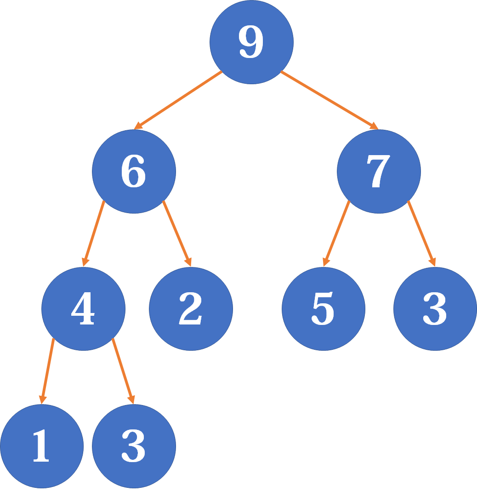
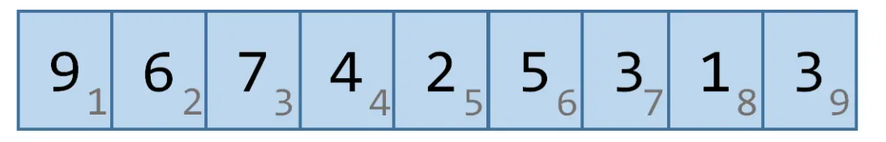
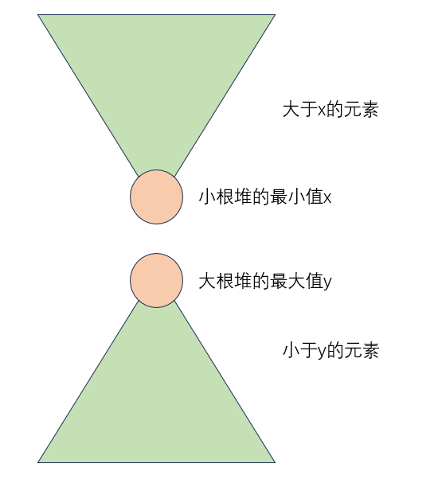
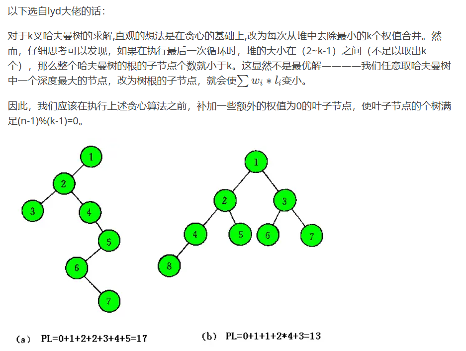

<!-- _class: cover_a 
<!-- _header: "" --> 
<!-- _footer: "" --> 
<!-- _paginate: "" --> 
# 堆
###### 基础

starAndHonor
北师大台州附属高级中学
2024.7.26

## 课程内容

<!-- _class: cols2_ol_ci fglass toc_a  -->
<!-- _footer: "" -->
<!-- _header: "CONTENTS" -->
<!-- _paginate: "" -->

- [优先队列](#3)
- [堆](#4)
- [priority_queue](#14) 
- [好题选讲](#16)

## 优先队列
实现一种数据结构
能够有
- top() : 取出最大值
- empty() 询问是否为空
- size() 查询元素数量
- push(x) 插入元素，并对底层容器排序
- pop() 删除最大元素（此时优先队列不能为空）
## 堆(heap)
堆（Heap）是一类数据结构，它们拥有树状结构，且能够保证父节点比子节点大（或小）。当根节点保存堆中最大值时，称为大根堆；反之，则称为小根堆。
堆有多种实现方式。二叉堆（Binary Heap）是最简单、常用的堆，是一棵符合堆的性质的完全二叉树。它可以实现$O(logn)$地插入或删除某个值，并且$O(1)$地查询最大（或最小）值。
## 

## 完全二叉树
作为完全二叉树，二叉堆完全可以用一个1-index的数组来存储，对于节点$p$，$p \times 2$即为左儿子，$p \times 2+1$即为右节点。同时，用$size$记录当前二叉堆中节点的个数。

## 插入
如何保证父节点比子节点大（或小）这个性质不被破坏？
```cpp
void insert(int x){
    heap[++size] = x;
    swim(size);
}
```
啥是swim操作？
## 上浮
很简单，不断与父节点比较，如果比父节点大（以大根堆为例，下同）就与之交换，直到不大于父节点或成为根节点为止。
```cpp
void swim(int n){
    for (int i = n; i > 1 && heap[i] > heap[i / 2]; i /= 2)
        swap(heap[i], heap[i / 2]);
}
```
## 下沉
类似地，不断与**较大的子节点**比较，如果比它小就与之交换，直到不小于任何子节点或成为叶子节点为止。之所以要与较大的子节点比较，是为了保证交换上来的节点比两个子节点都大。
```cpp
int son(int n){ // 找到需要交换的那个子节点
    return n * 2 + (n * 2 + 1 <= size && heap[n * 2 + 1] > heap[n * 2]);
}
void sink(int n){
    for (int i = n, t = son(i); t <= size && heap[t] > heap[i]; i = t, t = son(i))
        swap(heap[i], heap[t]);
}
```
## 删除
可以将根节点与最后一个节点交换，使size减1，然后再下沉。
```cpp
void pop(){
    swap(heap[1], heap[size--]);
    sink(1);
}
```
## 查询
```cpp
int top(){
    return heap[1];
}
```
## 建堆
为啥从$\frac{n}{2}$开始？叶子节点不需要下沉
```cpp
void build(int A[], int n) // 从一个（这里是0-index的）数组O(n)地建立二叉堆
{
    memcpy(heap + 1, A, sizeof(int) * n);
    size = n;
    for (int i = n / 2; i > 0; --i)
        sink(i);
}
```
## 
build.png)
## STL
首先你需要一个头文件：```#include<queue>```
```cpp
priority_queue<int> q;//这是一个大根堆q
priority_queue<int,vector<int>,greater<int> >q;//这是一个小根堆q
//注意某些编译器在定义一个小根堆的时候greater<int>和后面的>要隔一个空格，不然会被编译器识别成位运算符号>>
```
```cpp
//一些操作
q.top()//取得堆顶元素，并不会弹出
q.pop()//弹出堆顶元素
q.push()//往堆里面插入一个元素
q.empty()//查询堆是否为空，为空则返回1否则返回0
q.size()//查询堆内元素数量
```
## 重载比较函数
```cpp
struct st {
  int v, d;
  friend bool operator<(st a, st b) { return a.d > b.d; }
};
priority_queue<st> q;
```
## 好题选讲
<!-- _class: trans -->
<!-- _footer: "" -->
<!-- _paginate: "" -->
## 【模板】堆[P3378](https://www.luogu.com.cn/problem/P3378)

给定一个数列，初始为空，请支持下面三种操作：

1. 给定一个整数 $x$，请将 $x$ 加入到数列中。
2. 输出数列中最小的数。
3. 删除数列中最小的数（如果有多个数最小，只删除 $1$ 个）。
## 中位数[P1168](https://www.luogu.com.cn/problem/P1168)
给定一个长度为 $N$ 的非负整数序列 $A$，对于前奇数项求中位数。
## 解：
一个大根堆X，一个小根堆Y，对于一个数z,如果X.top() > z,X.push(z)
如果Y.top() < z,Y.push(z),这样保证了X中所有元素均小于Y,然后调整，两个堆的大小到只相差1(将size大的堆堆顶元素弹到另一个堆)，中位数为元素较多的堆的堆顶元素。

##
```cpp
priority_queue<int, vector<int>> g;               //大根堆
priority_queue<int, vector<int>, greater<int>> l; //小根堆
void insert(int x) {
  if (g.empty() || g.top() > x)
    g.push(x);
  else
    l.push(x);
  while (g.size() > l.size() + 1)
    l.push(g.top()), g.pop();
  while (l.size() > g.size() + 1)
    g.push(l.top()), l.pop();
}

cout << (g.size() >= l.size() ? g.top() : l.top()) << endl;

```
##  [NOIP2004 提高组] 合并果子 [P1090](https://www.luogu.com.cn/problem/P1090)

在一个果园里，多多已经将所有的果子打了下来，而且按果子的不同种类分成了不同的堆。多多决定把所有的果子合成一堆。

每一次合并，多多可以把两堆果子合并到一起，消耗的体力等于两堆果子的重量之和。可以看出，所有的果子经过 $n-1$ 次合并之后， 就只剩下一堆了。多多在合并果子时总共消耗的体力等于每次合并所耗体力之和。

因为还要花大力气把这些果子搬回家，所以多多在合并果子时要尽可能地节省体力。假定每个果子重量都为 $1$ ，并且已知果子的种类 数和每种果子的数目，你的任务是设计出合并的次序方案，使多多耗费的体力最少，并输出这个最小的体力耗费值。

例如有 $3$ 种果子，数目依次为 $1$ ， $2$ ， $9$ 。可以先将 $1$ 、 $2$ 堆合并，新堆数目为 $3$ ，耗费体力为 $3$ 。接着，将新堆与原先的第三堆合并，又得到新的堆，数目为 $12$ ，耗费体力为 $12$ 。所以多多总共耗费体力 $=3+12=15$ 。可以证明 $15$ 为最小的体力耗费值。

## 解：
由例子大胆猜测是最小的两堆不断合并
下证:不断合并最小的两堆是该问题的最优解
我们不妨将取石子的过程画出来

将取石子的过程看做一棵树，定义设 $w_i$ 为二叉树第 i 个叶结点的权值，$l_i$ 为从根结点到第 i 个叶结点的路径长度
$$ans = \sum{w_il_i}$$
## 
你需要证明
1. 最小的两个一定是放在最下面，而且是兄弟
proof：反证，假定最小的一个x不在最底层，此时ans取最小值A，将其与底层某个元素y交换,则ans改变量$\Delta$为$w_xl_x-w_yl_y$,由假设有$w_x < w_y,l_x < l_y$,所以$\Delta<0$,所以$ans^{\prime} < A$，与A为最小值矛盾
2. 最优树删去最小的两个，父节点充当叶子，值为两个之和，则依旧是最优树
proof:反证，假定最小两个删去前为$ans_1$,删去后为$ans_2$，最小的两个权值为a,b,则
$$ans_1 = ans_2+a+b$$
若删去后不是最优树，那么必定有删去后最小值$ans_3$,满足$ans_3 < ans_2$,然后将两个叶子节点添加回来，
$$ans_1 = ans_3+a+b$$
$ans_2=ans_3$,矛盾。
## Huffman tree
设二叉树具有 n 个带权叶结点，从根结点到各叶结点的路径长度与相应叶节点权值的乘积之和称为 树的带权路径长度（Weighted Path Length of Tree，WPL）。
对于给定一组具有确定权值的叶结点，可以构造出不同的二叉树，其中，WPL 最小的二叉树 称为 霍夫曼树（Huffman Tree）。

## 可以更快吗
两个队列维护，一个存原有的石头(从小到大)，一个存合并产生的石头，
考虑到结果只有可能由两个队列的队首得到
另外排序使用桶排($a \le 2\times 10^4$)
## [NOI2015] 荷马史诗[P2168](https://www.luogu.com.cn/problem/P2168)
Allison 最近迷上了文学。她喜欢在一个慵懒的午后，细细地品上一杯卡布奇诺，静静地阅读她爱不释手的《荷马史诗》。但是由《奥德赛》和《伊利亚特》 组成的鸿篇巨制《荷马史诗》实在是太长了，Allison 想通过一种编码方式使得它变得短一些。

一部《荷马史诗》中有 $n$ 种不同的单词，从 $1$ 到 $n$ 进行编号。其中第 $i$ 种单词出现的总次数为 $w_i$。Allison 想要用 $k$ 进制串 $s_i$ 来替换第 $i$ 种单词，使得其满足如下要求：

对于任意的 $1\leq i, j\leq n$ ，$i\ne j$ ，都有：$s_i$ 不是 $s_j$ 的前缀。

现在 Allison 想要知道，如何选择 $s_i$，才能使替换以后得到的新的《荷马史诗》长度最小。在确保总长度最小的情况下，Allison 还想知道最长的 $s_i$ 的最短长度是多少？

一个字符串被称为 $k$ 进制字符串，当且仅当它的每个字符是 $0$ 到 $k-1$ 之间（包括 $0$ 和 $k-1$ ）的整数。

字符串 $str1$ 被称为字符串 $str2$ 的前缀，当且仅当：存在 $1 \leq t\leq m$ ，使得 $str1 = str2[1..t]$。其中，$m$ 是字符串 $str2$ 的长度，$str2[1..t]$ 表示 $str2$ 的前 $t$ 个字符组成的字符串。

## 解：
k叉huffman tree

##  [USACO09OPEN] Work Scheduling G
约翰有太多的工作要做。为了让农场高效运转，他必须靠他的工作赚钱，每项工作花一个单位时间。 他的工作日从 $0$ 时刻开始，有 $10^9$ 个单位时间。在任一时刻，他都可以选择编号 $1$ 到 $N$ 的 $N(1 \leq N \leq 10^5)$ 项工作中的任意一项工作来完成。 因为他在每个单位时间里只能做一个工作，而每项工作又有一个截止日期，所以他很难有时间完成所有N个工作，虽然还是有可能。 对于第 $i$ 个工作，有一个截止时间 $D_i(1 \leq D_i \leq 10^9)$，如果他可以完成这个工作，那么他可以获利 $P_i( 1\leq P_i\leq 10^9 )$. 在给定的工作利润和截止时间下，约翰能够获得的利润最大为多少.
## 解：
先按照截止日期排序，然后一个工作有时间做，就先做了，如果没时间就选取前面做的工作里价值最小的工作换做当前工作。用堆维护。
## 代码
```cpp
  priority_queue<int, vector<int>, greater<int>> s;
  sort(task + 1, task + 1 + n);
  for (int i = 1; i <= n; i++) {
    if (task[i].first <= s.size()) {
      if (task[i].second > s.top()) {
        ans += task[i].second - s.top();
        s.pop();
        s.push(task[i].second);
      }
    } else
      s.push(task[i].second), ans += task[i].second;
  }
```

## 欢迎交流~~~ 

<!-- _class: trans -->
<!-- _footer: "" -->
<!-- _paginate: "" -->
<div>

</div>

