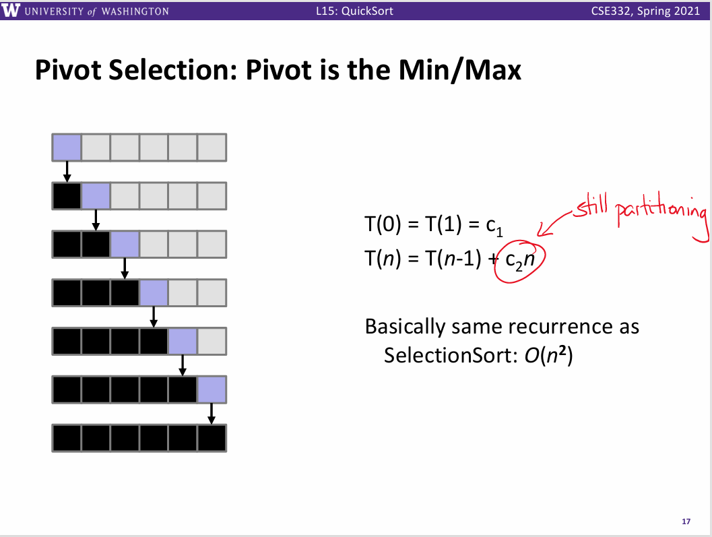

<!-- _class: cover_a 
<!-- _header: "" --> 
<!-- _footer: "" --> 
<!-- _paginate: "" --> 
# 排序算法
###### 基础

starAndHonor
北师大台州附属高级中学
2024.7.26

## 课程内容

<!-- _class: cols2_ol_ci fglass toc_a  -->
<!-- _footer: "" -->
<!-- _header: "CONTENTS" -->
<!-- _paginate: "" -->

- [前置芝士](#3)
- [排序?](#19)
- [冒泡排序](#25) 
- [选择排序](#31)
- [归并排序](#35)
- [快速排序](#42)
- [经典问题](#56)
- [最后一页](#75)
## 如何衡量一个算法的优劣

<!-- _class: trans -->
<!-- _footer: "" -->
<!-- _paginate: "" -->

##


## 时间复杂度和空间复杂度
- 跑一下？(电脑配置不同，耗费时间太多)
- 理论上分析

## 估算时间复杂度
当用运行时间去描述一个算法快慢的时候，算法中执行的**总步数**显得尤为重要
假设每一行代码运行需要一个单位时间,那么
$$算法的总的运行时间=运行的总代码行数$$

下例中运行n次。
```cpp
for(int i = 1;i <= n;i++){
  sum += i;
}
```

## 大O表示法
我们更加关心时间复杂度上界，由此人们引入了大O表示法。**执行次数函数的最高阶**


## 


## 例子
- O(1)
```cpp
sum += 1;
```
- O(n)
```cpp
for(int i = 1;i <= n;i++)
  sum += i;
```

## 例子
- O(logn)
```cpp
m = 1;
while(m<=n)m*=2
```
- O($n^2$)
```cpp
for(int i = 1;i <= n;i++)
  for(int j = 1;j <= n;j++)
    ans += i*j;
```
## 空间复杂度
例子：开了一个数组a[2n+3],空间复杂度为O(n)
<!-- _class:  bq-purple -->
>扫盲
>
>1B = 8bit
>1KB = 1024B
>1MB = 1024KB
>1G = 1024MB

## 算一算
```cpp
//认为n,p,m同阶
for (int i = 0; i < m; ++i) 
    for (int j = 0; j < p; ++j) 
        for (int k = 0; k < n; ++k) 
            C[i][j] += A[i][k] * B[k][j];
```
## 递归回顾
<!-- _class: trans -->
<!-- _footer: "" -->
<!-- _paginate: "" -->


##  


## 递归三要素

1. 函数的功能
2. 递归的结束条件
3. 如何减小问题规模

## 递归式

形如
$$T(n) = a*T(\frac{n}{b})+f(n),a,b \ge 1,且a,b为常数$$
这个递归式将规模为n的问题分解为a个子问题，每个子问题的规模为n/b，a个子问题递归地求解，每个花费时间T(n/b)。函数f(n)包含了问题分解和子问题解合并的代价。
## 主定理Master theorem


## 证明以及一些参考文献
[CS 161 Lecture 3 Jessica Su (some parts copied from CLRS)](./ref/lecture3.pdf)
[时空复杂度分析及master定理](https://www.luogu.com.cn/article/awubkrso)
[重谈主定理（master定理）及其证明](https://www.luogu.com.cn/article/w3avh1ku)
<br>
等你们熟练使用数列求和以后可以尝试
对OI来说你会结论就可以解决99%的问题
但是会有特例

## 排序?
<!-- _class: trans -->
<!-- _footer: "" -->
<!-- _paginate: "" -->

## 
> 道生一，一生二，二生三，三生万物。

## 我们从1个数开始

对于只有一个数的数列，本身就是有序的
## 两个数
<!-- _class: cols-2-73 -->

<div class=limg>

**交换swap**操作
在一定情况下可以消解无序性

</div>

<div class=rdiv>


</div>

## 三个数

Q:对于什么样的两个数进行交换可以消解无序性
A:当前位置关系下的大小关系与目标大小关系相悖，即**逆序**

## 六个人


Q:啥时候排序好了？
A:每个人都看左边的一个人比自己矮，看右边的一个人比自己高。(首尾只要满足一边看得到)

## 那么，我们大胆考虑，
碰到相邻的逆序元素就交换
试一下,还真行


## 

我们称遍历一次数组，碰到相邻的逆序元素就交换，一次**冒泡**
由上个例子发现**一次冒泡可以使得一个数归位**
那么需要几次冒泡才能使得长度为n的数组有序
n次？
n-1次！最后一个数不用冒泡一定有序
这个算法叫做**冒泡排序**

## 

## code
```cpp
for (int i = 1; i <= n - 1; i++)
        for (int j = 1; j <= n - i; j++)
                if (arr[j] > arr[j + 1])
                        swap(arr[j], arr[j + 1]);
```

## 优化?
我们发现一些情况下不需要n-1次就已经有序
设一个**flag变量**，如果不发生交换，标记一下退出循环
```cpp
bool flag = true;
while (flag) {
  flag = false;
  for (int i = 1; i < n; ++i) {
    if (a[i] > a[i + 1]) {
      flag = true;
      swap(a[i],a[i+1]);
    }
  }
}
```

## 复杂度
最好O(n),在序列完全有序时，冒泡排序只需遍历一遍数组，不用执行任何交换操作。
最坏O($n^2$),在序列完全逆序时，执行$\frac{(n-1)*n}{2}$交换

## 选择排序
1. 首先在未排序序列中找到最小（大）元素，存放到排序序列的起始位置。

2. 再从剩余未排序元素中继续寻找最小（大）元素，然后放到已排序序列的末尾。

3. 重复第二步，直到所有元素均排序完毕。


## code 
```cpp
for (int i = 1 ; i <= len ; i++){
  int min = i;
  for (int j = i + 1; j <= len; j++)    
    if (arr[j] < arr[min])    
      min = j;   
  swap(arr[min], arr[i]);    
}
```
## 复杂度
时间复杂度O($n^2$)

## 快一点！
<!-- _class: trans -->
<!-- _footer: "" -->
<!-- _paginate: "" -->

## 祖师爷会出手


## 归并排序
```
If only one number
    Quit
Else
    Sort left half of number
    Sort right half of number
    Merge sorted halves
```
## 例子


## 代码实现
如何将左右两部分有序子数列合并成一个有序数列？
```cpp
void merge(int l,int r,int mid,int tmp[]){
	int i = l,j = mid+1,k = 0;
	while(i<=mid&&j<=r){
		if(a[i]<=a[j]){tmp[k] = a[i];k++;i++;}
		else {tmp[k]  = a[j];k++;j++;}
	}
  //应对有剩余情况
	while(i<=mid){tmp[k] = a[i];k++;i++;}
	while(j<=r){tmp[k] = a[j];k++;j++;}
	k=0;
	while(l<=r) a[l] = tmp[k],l++,k++;
}
```
## 复杂度

递归式:
$$T(n) = 2*T(\frac{n}{2})+n$$

$a = 2,b  = 2,d = 1$ 满足 $a = b^d$ 时间复杂度为O(nlogn)

## 演示


## 
```cpp
void mergeSort(int l,int r){
    if(l>=r)return;
    int mid = l+r>>1;
    mergeSort(l,mid);
    mergeSort(mid+1,r);
    merge(l,r,mid,tmp);
}
```
## 快速排序
还记得[六个人](#24)吗
1. 选取一个pivot元素,
2. 将所有元素分为小于pivot和大于pivot两个部分
3. 递归排序小于pivot部分
4. 递归排序大于pivot部分


##


## 实现
我们如何实现 将所有元素分为小于pivot和大于pivot两个部分？
法一：新开一个数组，然后类似归并中合并的处理
空间不是很优
法二：**左右指针法**，
1. 首先 我们一般选取最左边的元素作为基准值 pivot。
2. 然后我们需要定义两个变量 i 和 j。
其中 i 为左指针(其实不是指针啦，只是为了方便这么叫它😋)，初始 i = 0。 j 为右指针，初始 j = r - 1，向左遍历不断找到小于基准值 key 的元素。
3. 我们**先动右指针** j 向左遍历直到找到小于当前基准值 key 的元素；然后我们**再动左指针** i 向右遍历直到找到大于当前基准值 key 的元素。
当 i 和 j 分别找到它们要找的元素时，我们需要将两个元素进行位置交换。( 在这个过程中我们要保持 i < j )
4. 重复步骤3，直到最后我们可爱的左右指针相遇，这时我们再将基准值 key，放到这两个指针指向的位置。此时我们就得到了当前划分的位置，基准值 key 也完成了归位。
## 为啥先动右再动左
在取基准值时，我们一般都是将序列的最左边位置的元素作为基准值。我们每次交换完元素后，左右指针都会继续寻找他们要找的值，观感上就是相互靠近。而问题就出在我们**退出循环的那一刻**。

我们一直保持 i < j，也就是说，我们会在 i == j 时退出循环。假设 在某次交换之后，此时 j 指向的是交换之后的一个大于基准值的元素，如果我们先动左指针 i 去寻找一个大于基准值的元素，然鹅还未找到就已经和右指针 j 相遇了，这个时候我们需要退出循环，交换基准值 key 到当前两个指针指向的位置。
**但是!!!**，此时 i 和 j 指向的是大于基准值的元素，那么我们进行交换基准值位置操作后，这个大于基准值的元素就被换到了序列的最左端，很明显，这时候出现了非常非常非常严重的错误。

那如果我们先动右指针 j，去寻找一个小于基准值的元素，然鹅没有找到就已经和左指针 i 相遇了，这个时候退出循环，i 和 j 指向的一定是一个小于等于基准值的值。

究其原因，**这其实是我们取最左边的元素作为基准值导致的**。我们需要保证每次交换过来的元素是小于等于基准值的，所以我们先动右指针，再动左指针。
## 

## 错误

##
```cpp
//左右指针法  
int Partition_Hoare(vector<int> &a, int left, int right){
    int i = left;
    int j = right;
    int key = a[left];

    while(i != j){
        while(i < j && a[j] >= key)      	 //向左找到小于基准值的值的下标
            j--;
        while(i < j && a[i] <= key)      	 //向右找到大于基准值的值的下标
            i++;
	swap(a[i], a[j]);
	}
    /*   i等于j时跳出循环 当前基准值此时在下标为i的位置(合适的位置)   */
    swap(a[left], a[i]);	                 //最左边的元素变为处于当前合适位置的元素,把基准值放在合适位置                                                 
    return i;                                  //返回合适位置(i,j都可以)
}
```

## 

## 那么为啥Quick?


## 


## 

## 

## 如何随机
```cpp
srand(time(NULL));
int r = rand()%(r-l+1)+l//生成[l,r]之间的整数
```
## 用于快排
```cpp
int random = rand() % (right - left + 1) + left;  
swap(a[random], a[left]);
int key = a[left];
```
## 经典问题 

<!-- _class: trans -->
<!-- _footer: "" -->
<!-- _paginate: "" -->
## 车厢重组[P1116](https://www.luogu.com.cn/problem/P1116)
在一个旧式的火车站旁边有一座桥，其桥面可以绕河中心的桥墩水平旋转。一个车站的职工发现桥的长度最多能容纳两节车厢，如果将桥旋转180度，则可以把相邻两节车厢的位置交换，用这种方法可以重新排列车厢的顺序。于是他就负责用这座桥将进站的车厢按车厢号从小到大排列。他退休后，火车站决定将这一工作自动化，其中一项重要的工作是编一个程序，输入初始的车厢顺序，计算最少用多少步就能将车厢排序。
车厢总数$N \le 10^4$
## 解：
求冒泡交换的次数
每交换一次减少一个逆序对
所以
$$冒泡排序交换数 = 逆序对数量 $$

##
```cpp
for(int i = 1;i < n;i++){
    for(int j = 1;j <= n - i;j++)
        if(a[j]>a[j+1])swap(a[j],a[j+1]),cnt++;
}
```
## 逆序对[P1908](https://www.luogu.com.cn/problem/P1908)
猫猫 TOM 和小老鼠 JERRY 最近又较量上了，但是毕竟都是成年人，他们已经不喜欢再玩那种你追我赶的游戏，现在他们喜欢玩统计。

最近，TOM 老猫查阅到一个人类称之为“逆序对”的东西，这东西是这样定义的：对于给定的一段正整数序列，逆序对就是序列中 $a_i>a_j$ 且 $i<j$ 的有序对。知道这概念后，他们就比赛谁先算出给定的一段正整数序列中逆序对的数目。注意序列中可能有重复数字。
$n \le 5 \times 10^5$
## 解:
归并排序的时候合并时可求
合并时右侧每一个数被加入数列时，左侧还未被加入数列的数与他形成逆序对。
## 第 k 小整数[P1138](https://www.luogu.com.cn/problem/P1138)

现有 $n$ 个正整数，要求出这 $n$ 个正整数中的第 $k$ 个最小整数（相同大小的整数只计算一次）。

## 解:
求数列第$k$大的数
法一：排序后直接求，复杂度为排序的复杂度
法二：可否O(n),考虑快排过程，每次只有可能走一边
左边有cnt个数,如果cnt < k,那么向左递归，反之向右递归

## 攀登者[P5143](https://www.luogu.com.cn/problem/P5143)
他在地形图上标记了 $N$ 个点，每个点 $P_i$ 都有一个坐标 $(x_i,y_i,z_i)$。所有点对中，高度值 $z$ 不会相等。HKE 准备从最低的点爬到最高的点，他的攀爬满足以下条件：

 (1) 经过他标记的每一个点；

 (2) 从第二个点开始，他经过的每一个点高度 $z$ 都比上一个点高；

 (3) HKE 会飞，他从一个点 $P_i$ 爬到 $P_j$ 的距离为两个点的欧几里得距离。即，$\sqrt{(X_i-X_j)^2+(Y_i-Y_j)^2+(Z_i-Z_j)^2}$

现在，HKE 希望你能求出他攀爬的总距离。
## 解
多个变量一同排序技巧：
法一：结构体+手写比较函数
法二：定义一个p_i = i,按照要排序的数排序p_i,利用p_i访问有序变量
sort重载cmp,按照z排序后求距离和
##  [NOIP2007 普及组] 奖学金[P1093](https://www.luogu.com.cn/problem/P1093)
某小学最近得到了一笔赞助，打算拿出其中一部分为学习成绩优秀的前 $5$ 名学生发奖学金。期末，每个学生都有 $3$ 门课的成绩：语文、数学、英语。先按总分从高到低排序，如果两个同学总分相同，再按语文成绩从高到低排序，如果两个同学总分和语文成绩都相同，那么规定学号小的同学排在前面，这样，每个学生的排序是唯一确定的。
任务：先根据输入的 $3$ 门课的成绩计算总分，然后按上述规则排序，最后按排名顺序输出前五名名学生的学号和总分。
注意，在前 $5$ 名同学中，每个人的奖学金都不相同，因此，你必须严格按上述规则排序。例如，在某个正确答案中，如果前两行的输出数据（每行输出两个数：学号、总分) 是：
7 279  
5 279
这两行数据的含义是：总分最高的两个同学的学号依次是 $7$ 号、$5$ 号。这两名同学的总分都是 $279$ (总分等于输入的语文、数学、英语三科成绩之和) ，但学号为 $7$ 的学生语文成绩更高一些。

## 解
sort重载cmp,按照题意模拟即可
## [NOIP2011 普及组] 瑞士轮[P1309](https://www.luogu.com.cn/problem/P1309)

$2 \times N$ 名编号为 $1\sim 2N$ 的选手共进行R 轮比赛。每轮比赛开始前，以及所有比赛结束后，都会按照总分从高到低对选手进行一次排名。选手的总分为第一轮开始前的初始分数加上已参加过的所有比赛的得分和。总分相同的，约定编号较小的选手排名靠前。

每轮比赛的对阵安排与该轮比赛开始前的排名有关：第$1$ 名和第$2$ 名、第 $3$ 名和第 $4$名、……、第$2K - 1$名和第$2K$名、……  、第$2N - 1$名和第$2N$名，各进行一场比赛。每场比赛胜者得$1$分，负者得 $0$分。也就是说除了首轮以外，其它轮比赛的安排均不能事先确定，而是要取决于选手在之前比赛中的表现。

现给定每个选手的初始分数及其实力值，试计算在R 轮比赛过后，排名第$ Q$ 的选手编号是多少。我们假设选手的实力值两两不同，且每场比赛中实力值较高的总能获胜。

## 解：
法一：每一次操作改变总分然后排序,时间复杂度$O(RNlogN)$,算一下$50\times200000\times log200000 \approx 1.8\times10^9$
法二：考虑到如果排序比赛后两者的相对大小关系不变。（分高胜利+1分更高，分低失败+0还是低），而且如果从大到小比赛且将两者放入两个数组，两个数组降序且有相对大小关系，所以只需要O(N)合并两个数组使之有序。
$O(N \times R)$
使用C++的merge()比较方便
## P7910 [CSP-J 2021] 插入排序[P7910](https://www.luogu.com.cn/problem/P7910)
too long 自己去看
## 解：
暴力：op1:O(1),op2:O(nlogn)
op1少，那么考虑让op1慢一点，让op2是O(1)。
op1:改一个数使用向两边冒泡O(n)即可，
op2:开一个pos[]记录一下排序前一次位置，同时需要记录当前位置(开个结构体表示数值和当前位置)，O(1)访问
## [NOIP2013 提高组] 火柴排队[P1966](https://www.luogu.com.cn/problem/P1966)
涵涵有两盒火柴，每盒装有 $n$ 根火柴，每根火柴都有一个高度。 现在将每盒中的火柴各自排成一列， 同一列火柴的高度互不相同， 两列火柴之间的距离定义为：$\sum (a_i-b_i)^2$

其中 $a_i$ 表示第一列火柴中第 $i$ 个火柴的高度，$b_i$ 表示第二列火柴中第  $i$ 个火柴的高度。

每列火柴中相邻两根火柴的位置都可以交换，请你通过交换使得两列火柴之间的距离最小。请问得到这个最小的距离，最少需要交换多少次？如果这个数字太大，请输出这个最小交换次数对 $10^8-3$ 取模的结果。

对于 $100\%$ 的数据，$1 \leq n \leq 10^5$，$0 \leq$ 火柴高度 $< 2^{31}$。
## 
难点1:最小化 $\sum (a_i-b_i)^2$
拆
$\sum (a_i-b_i)^2 = \sum a_i^2+\sum b_i^2-2\sum a_ib_i$
然后求$\sum a_ib_i$最小值，
由排序不等式$反序和\le乱序和\le同序和$
可知两个数列的排名一一对应即可
操作就交换，那么就是用一个数列的相对大小关系重新排列另一个
求逆序对
难点2：数据大，但其实有关系的是相对大小，离散化
## 离散化
1.创建原数组的副本。

2.将副本中的值从小到大排序。

3.将排序好的副本去重。

4.查找原数组的每一个元素在副本中的位置，位置即为排名，将其作为离散化后的值。
```cpp
// arr[i] 为初始数组,下标范围为 [1, n]

for (int i = 1; i <= n; ++i)  // step 1
  tmp[i] = arr[i];
std::sort(tmp + 1, tmp + n + 1);                          // step 2
int len = std::unique(tmp + 1, tmp + n + 1) - (tmp + 1);  // step 3
for (int i = 1; i <= n; ++i)                              // step 4
  arr[i] = std::lower_bound(tmp + 1, tmp + len + 1, arr[i]) - tmp;
```
## 欢迎交流~~~ 

<!-- _class: trans -->
<!-- _footer: "" -->
<!-- _paginate: "" -->
<div>

</div>

