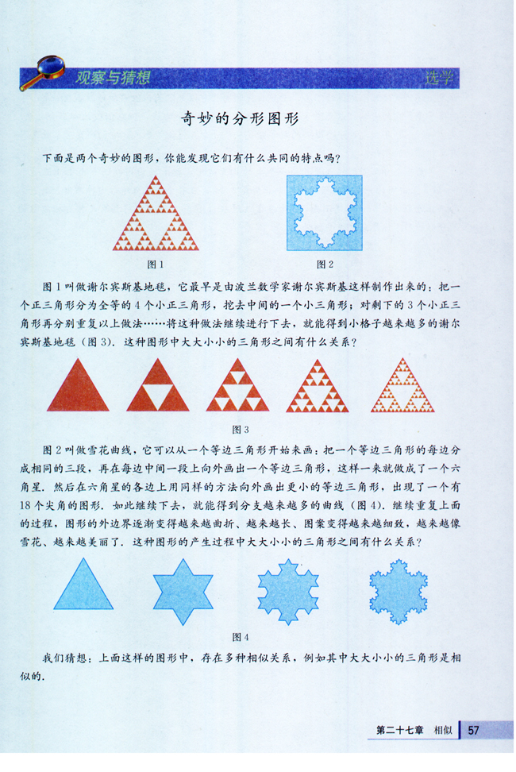
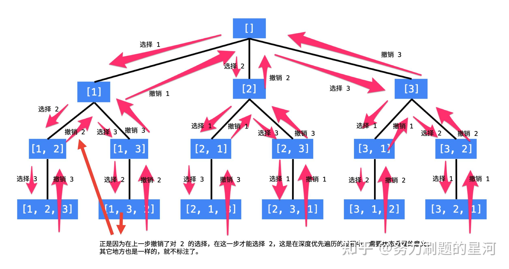
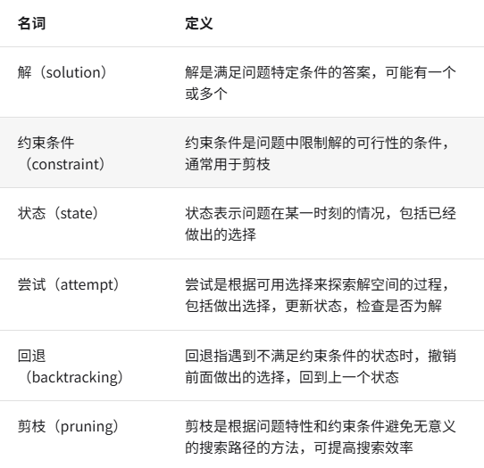
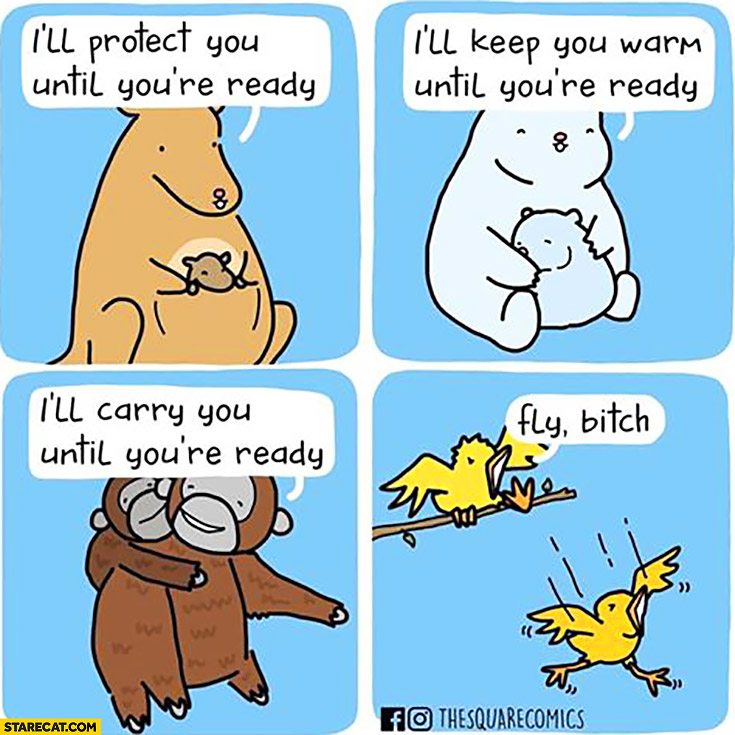

<!-- _class: cover_a 
<!-- _header: "" --> 
<!-- _footer: "" --> 
<!-- _paginate: "" --> 
# 搜索与回溯
###### 基础

starAndHonor
北师大台州附属高级中学
2024.7.26

## 课程内容

<!-- _class: cols2_ol_ci fglass toc_a  -->
<!-- _footer: "" -->
<!-- _header: "CONTENTS" -->
<!-- _paginate: "" -->

- [DFS](#8)
- [好题选讲](#18)


## 
<!-- _class: cols-2-46 -->

<div class=ldiv>

模拟只会猜题意，贪心只能过样例。

数学上来先打表，动规一般看规律。

组合数学靠运气，计算几何瞎暴力。

图论一顿套模板， 数论只会GCD。

递归递推伤不起，搜索茫然TLE。

分治做得像枚举，暴力枚举数第一。

数据结构干瞪眼，怒刷水题找信心。

涨姿势也不容易，考试一来全懵逼。
</div>

<div class=rimg>


</div>

## BDFS
百度搜索优先算法(BaiDu First Search)……

## 赦免战俘[P5461](https://www.luogu.com.cn/problem/P5461)
现有 $2^n\times 2^n (n\le10)$ 名作弊者站成一个正方形方阵等候 kkksc03 的发落。kkksc03 决定赦免一些作弊者。他将正方形矩阵均分为 4 个更小的正方形矩阵，每个更小的矩阵的边长是原矩阵的一半。其中左上角那一个矩阵的所有作弊者都将得到赦免，剩下 3 个小矩阵中，每一个矩阵继续分为 4 个更小的矩阵，然后通过同样的方式赦免作弊者……直到矩阵无法再分下去为止。所有没有被赦免的作弊者都将被处以棕名处罚。

给出 $n$，请输出每名作弊者的命运，其中 0 代表被赦免，1 代表不被赦免。
## 解：
```cpp
void f(int n, int m, int l) {
	if (l == 1) return ;
	for (int i = n; i < n + l / 2; i++) {
		for (int j = m; j < m + l / 2; j++) {
			a[i][j] = 0;
		}
	}
	f(n + l / 2, m, l / 2);
	f(n, m + l / 2, l / 2);
	f(n + l / 2,m + l / 2, l / 2);
}
```
## 分形问题

## 深度优先搜索(DFS)
<!-- _class: trans -->
<!-- _footer: "" -->
<!-- _paginate: "" -->

## 引例
请求出$1 \sim n$的**全排列**。


全排列:从n个不同元素中任取m（m≤n）个元素，按照一定的顺序排列起来，叫做从n个不同元素中取出m个元素的一个排列。当m=n时所有的排列情况叫全排列。

```
例如，n = 3时，1-3的全排列为：
1 2 3
1 3 2
2 1 3
2 3 1
3 2 1
3 1 2
```

## 
**如何不重不漏的写出全排列？**
假定第一位是1，假定第二是2，然后得到1，2，3
然后假定第二位是3，得到1，3，2
…………
## 
```cpp
bool vis[MAXN];
void dfs(int pos){
  if(pos>n){out(a);return;}//out函数实现输出a
  for(int i = 1;i < n;i++){
    if(!vis[i]){
      vis[i] = true;a[pos] = i;
      dfs(pos+1);
      vis[i] = false;a[pos] = 0;//a[pos] = 0这句没有也行，覆盖
    }
  }
}
```
## 深入理解DFS的过程

## 深度优先？
一条路走到黑，不撞南墙不回头。
## 

## 回溯
算法在搜索解空间时会采用“尝试”与“回退”的策略。

## run one run
```cpp
void dfs(int u){
  if(u == 10)return;
  for(int i = 1;i <= u;i++)cout << "*";
  cout<<"\n";
  dfs(u+1);
}
```
```cpp
void dfs(int u){
  if(u == 10)return;
  dfs(u+1);
  for(int i = 1;i <= u;i++)cout << "*";
  cout<<"\n";
}
```

## dfs模板
```cpp
void dfs(int x,int y,……){
  //停止条件
  //向下递归前的操作
  //进入下一层递归
  //向上回溯时操作
}
//可以有返回值
```
## 搜索算法是练出来的

没有骂人的意思🙏,别喷我
## 组合数[P1157]
组合就是从n个元素中抽出r个元素(不分顺序且r<＝n)，我们可以简单地将n个元素理解为自然数1，2，…，n，从中任取r个数。
现要求你用递归的方法输出所有组合。
例如n＝5，r＝3，所有组合为：
```1 2 3   1 2 4   1 2 5   1 3 4   1 3 5   1 4 5   2 3 4   2 3 5   2 4 5   3 4 5```
## 
```cpp
void dfs(int pos,int now){
  if(pos > r){out(a);return;}
  for(int i = now;i <= n;i++){
    a[pos] = i;
    dfs(pos+1,i + 1);
  }
}
```
## 子集[B3622]
今有 n 位同学，可以从中选出任意名同学参加合唱。
请输出所有可能的选择方案。
##
```cpp
void dfs(int pos,int u){
  if(u > n){out(b);return;}
  b[pos] = a[u];
  dfs(pos+1,u+1);
  b[pos] = 0;
  dfs(pos,u+1);
}
```
## [NOIP2001 普及组] 装箱问题[P1049]
有一个箱子容量为 $V$，同时有 $n$ 个物品，每个物品有一个体积。

现在从 $n$ 个物品中，任取若干个装入箱内（也可以不取），使箱子的剩余空间最小。输出这个最小值。
## 
子集问题
```cpp
void dfs(int pos,int u){
  if(u > n){ans  = min(eva(b),ans);return;}//eva计算b中元素装入后的剩余空间
  b[pos] = a[u];
  dfs(pos+1,u+1);
  b[pos] = 0;
  dfs(pos,u+1);
}
```
## [NOIP2006 普及组] 开心的金明[P1060]


金明今天很开心，家里购置的新房就要领钥匙了，新房里有一间他自己专用的很宽敞的房间。更让他高兴的是，妈妈昨天对他说：“你的房间需要购买哪些物品，怎么布置，你说了算，只要不超过 $N$ 元钱就行”。今天一早金明就开始做预算，但是他想买的东西太多了，肯定会超过妈妈限定的 $N$ 元。于是，他把每件物品规定了一个重要度，分为 $5$ 等：用整数 $1-5$ 表示，第 $5$ 等最重要。他还从因特网上查到了每件物品的价格（都是整数元）。他希望在不超过 $N$ 元（可以等于 $N$ 元）的前提下，使每件物品的价格与重要度的乘积的总和最大。

设第$j$件物品的价格为 $v_j$，重要度为 $w_j$，共选中了 $k$ 件物品，编号依次为 $j_1,j_2,…,j_k$，则所求的总和为：

$$v_{j_1} \times w_{j_1}+v_{j_2} \times w_{j_2} …+v_{j_k} \times w_{j_k}$$

请你帮助金明设计一个满足要求的购物单。
## 
子集问题
```cpp
void dfs(int pos,int u){
  if(u > n){ans  = max(eva(b),ans);return;}//eva按题意计算总和
  b[pos] = a[u];
  dfs(pos+1,u+1);
  b[pos] = 0;
  dfs(pos,u+1);
}
```
## [NOIP2002 普及组] 选数[P1036](https://www.luogu.com.cn/problem/P1036)
已知 $n$ 个整数 $x_1,x_2,\cdots,x_n$，以及 $1$ 个整数 $k$（$k<n$）。从 $n$ 个整数中任选 $k$ 个整数相加，可分别得到一系列的和。例如当 $n=4$，$k=3$，$4$ 个整数分别为 $3,7,12,19$ 时，可得全部的组合与它们的和为：

$3+7+12=22$

$3+7+19=29$

$7+12+19=38$

$3+12+19=34$

现在，要求你计算出和为素数共有多少种。

例如上例，只有一种的和为素数：$3+7+19=29$。

## 
组合问题
```cpp
void dfs(int pos,int now){
  if(pos > r){if(check(sum(a)))cnt++;return;}//check实现判断质数，sum实现对已选元素求和。
  for(int i = now;i <= n;i++){
    a[pos] = i;
    dfs(pos+1,i + 1);
  }
}
```
## 
上面我们讲述了三个模型，排列，组合，子集
可以用来枚举问题的所有可能解，再判断解的可行性就可以得到答案。
## [USACO1.5] 八皇后 Checker Challenge[P1219](https://www.luogu.com.cn/problem/P1219)

一个如下的 $6 \times 6$ 的跳棋棋盘，有六个棋子被放置在棋盘上，使得每行、每列有且只有一个，每条对角线（包括两条主对角线的所有平行线）上至多有一个棋子。


请编一个程序找出所有棋子放置的解。  
## 
思路一：先保证行，再保证列，最后check一下对角线
思路二：对角线也在搜索的时也考虑
##
思路一：太慢，会TLE
```cpp
void dfs(int row) {
	if (row > n) {
		if (check()) {}//输出
    return;
  }
	for (int i = 1; i <= n; i++) {
		if (!vis[i]) {
			a[row][i] = 1;
			vis[i] = true;
			dfs(row + 1);
			a[row][i] = 0;
			vis[i] = false;
		}
	}
}
```
## check()
```cpp
bool check() {
	for (int i = 2; i <= n * 2; i++) {
		int cnt1 = 0, cnt2 = 0;
		for (int x = 1; x <= i - 1; x++) {
			if (a[x][i - x])cnt1++;
			if (n + 1 - x > 0 && i - x <= n && a[n - x + 1][i - x])cnt2++;
		}
		if (cnt1 > 1 || cnt2 > 1)return false;
	}
	return true;
}
```

## 打表
注意到虽然说会TLE,但是题目所给范围过小。
可以在本地跑出答案后提交。
##
思路二：发现两条对角线有row+col为定值和row-col为定值
```cpp
void dfs(int row) {
	if (row > n) {return;}
	for (int j = 1; j <= n; j++) {
		if (!(a[row]||b[j] || c[row + j] || d[row - j + base])) {
			a[row] = true;b[j] = true;c[row + j] = true;d[row - j + base] = true;
			ans[row] = j;
			dfs(row + 1);
			a[row] = false;b[j] = false;c[row + j] = false;d[row - j + base] = false;
		}
	}
}
//+base防止负数
```
## 什么决定了速度
思路一：枚举了所有满足不同行，不同列的所有棋盘
思路二：枚举了所有满足不同行，不同列并且满足对角线条件的所有棋盘
思路二搜索的状态数更少，搜索树更小，所以更加快
优化一个搜索算法的关键是减少搜索树的大小
## 小猫爬山[P10483](https://www.luogu.com.cn/problem/P10483)
Freda 和 rainbow 饲养了 $N(N\le 18)$ 只小猫，这天，小猫们要去爬山。经历了千辛万苦，小猫们终于爬上了山顶，但是疲倦的它们再也不想徒步走下山了

Freda 和 rainbow 只好花钱让它们坐索道下山。索道上的缆车最大承重量为 $W$，而 $N$ 只小猫的重量分别是 $C_1,C2,\dots C_N$。当然，每辆缆车上的小猫的重量之和不能超过 $W(1\le C_i,W \le 10^8)$。每租用一辆缆车，Freda 和 rainbow 就要付 $1$ 美元，所以他们想知道，最少需要付多少美元才能把这 $N$ 只小猫都运送下山？
## 
```cpp
void dfs(int now,int cnt){
  if(now > n){
    ans = min(ans,cnt);
    return;
  }
  for(int i = 1;i <= cnt;i++){
    if(cab[i] + c[now] <= w){
      cab[i]+=c[now];
      dfs(now+1,cnt);
      cab[i] -= c[now];
    }
  }
  cab[cnt+1] = c[now];
  dfs(now+1,cnt+1);
  cab[cnt+1] = 0;
}
```
## 剪枝
1. 最优性剪枝：如果cnt>ans,说明不可能更优
2. 优化搜索顺序：小质量的小猫先运，大质量的猫后运


```cpp
void dfs(int now,int cnt){
  if(cnt >= ans)return;
  if(now > n){
    ans = min(ans,cnt);
    return;
  }
  for(int i = 1;i <= cnt;i++){
    if(cab[i] + c[now] <= w){
      cab[i]+=c[now];
      dfs(now+1,cnt);
      cab[i] -= now;
    }
    cab[cnt+1] = c[now];
    dfs(now+1,cnt+1);
    cab[cnt+1] = 0;
  }
}
//主函数里排个序
```
##
具体内容等后人来教
1.优化搜索顺序:这题中就用了:先找可选方案数最少得格子
2.排除冗余信息
3.可行性剪枝
4.最优性剪枝(例题:小猫爬山)(只有在求最优解时才可能有)
5.记忆化(类似于DP)
##  [NOIP2021] 数列[P7961](https://www.luogu.com.cn/problem/P7961)
给定整数 $n, m, k$，和一个长度为 $m + 1$ 的正整数数组 $v_0, v_1, \ldots, v_m$。

对于一个长度为 $n$，下标从 $1$ 开始且每个元素均不超过 $m$ 的非负整数序列 $\{a_i\}$，我们定义它的权值为 $v_{a_1} \times v_{a_2} \times \cdots \times v_{a_n}$。

当这样的序列 $\{a_i\}$ 满足整数 $S = 2^{a_1} + 2^{a_2} + \cdots + 2^{a_n}$ 的二进制表示中 $1$ 的个数不超过 $k$ 时，我们认为 $\{a_i\}$ 是一个合法序列。

计算所有合法序列 $\{a_i\}$ 的权值和对 $998244353$ 取模的结果。

##
```cpp
int w = 1;
void dfs(int u) {
  if (u == n + 1) {
    if (__builtin_popcountll(s) <= k)//这个函数可以统计long long的二进制表示中1的个数
      ans = (ans + w) % mod;
    return;
  }
  for (int i = 1; i <= m+1; i++) {
    int tmp = w;
    s += (1 << i-1), w = w * v[i] % mod;
    dfs(u + 1);
    s -= (1 << i-1), w = tmp;
  }
}
```
## 欢迎交流~~~ 

<!-- _class: trans -->
<!-- _footer: "" -->
<!-- _paginate: "" -->
<div>

</div>
