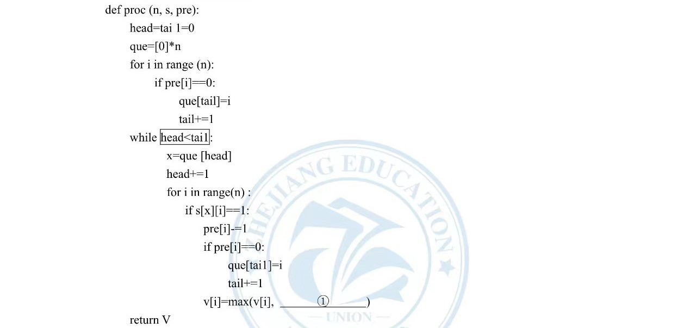
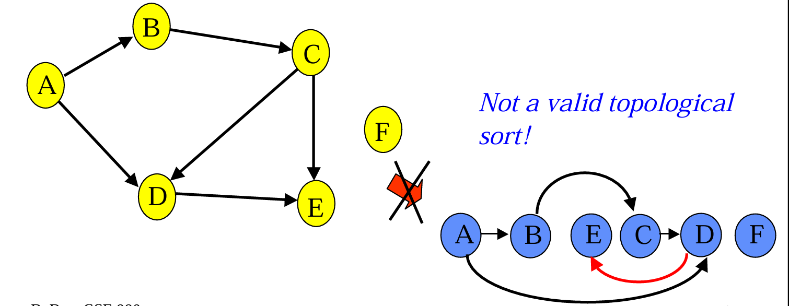

<!-- _class: cover_a 
<!-- _header: "" --> 
<!-- _footer: "" --> 
<!-- _paginate: "" --> 
# 有向无环图(DAG)上算法
###### 进阶

starAndHonor
北师大台州附属高级中学
2024.7.15

## 课程内容

<!-- _class: cols2_ol_ci fglass toc_a  -->
<!-- _footer: "" -->
<!-- _header: "CONTENTS" -->
<!-- _paginate: "" -->

- [基础回顾](#3)
- [拓扑排序](#6) 
- [好题选讲](#9)
- [最后一页](#28)

## 什么是DAG

<!-- _class: trans -->
<!-- _footer: "" -->
<!-- _paginate: "" -->

## 有向无环图（DAG）

不言而喻


## DAG的性质

<!-- _class: col1_ol_sq fglass -->

- 有向无环图，一定能拓扑排序
- 能 拓扑排序 的图，一定是有向无环图


## 拓扑排序
<!-- _class: trans -->
<!-- _footer: "" -->
<!-- _paginate: "" -->

## 不会到现在还有人不会拓扑排序吧？

<!-- _class: cols-2-73 -->

<div class=limg>



</div>

<div class=rdiv>

**拓扑排序**是对**DAG**（有向无环图）上的节点进行排序，使得对于每一条有向边 $u \rightarrow v$,$u$都在 $v$之前出现。简单地说，是在不破坏节点**先后顺序**的前提下，把**DAG**拉成一条链。

左图是杭州一模(不会拓扑排序的反思一下)

</div>

## 板子
```cpp
// deg是入度，在存图的时候需要录入数据, A是排序后的数组
queue<int> q;
for (int i = 1; i <= n; ++i)
  if (deg[i] == 0)
      q.push(i);
while (!q.empty()){
  int t = q.front();
  q.pop();
  A[cnt++] = t;
  for (auto to : edges[t]){
    deg[to]--;
  if (deg[to] == 0) // 出现了新的入度为0的点
     q.push(to);
  }
}
```


## 好题选讲
<!-- _class: trans -->
<!-- _footer: "" -->
<!-- _paginate: "" -->

## Fox And Names[CF510C](https://www.luogu.com.cn/problem/CF510C) 
Fox Ciel打算在FOCS（Foxes Operated Computer Systems，发音为“Fox”）上发表一篇论文。她听说：论文上的作者列表总是按字典顺序排列。

经过检查一些例子后，她发现有时这并不成立。在一些论文上，作者的名字并不是按照字典顺序排列的。但总是可以通过对字母顺序进行一些修改后，作者的顺序变得按照字典顺序排列！

她想知道，拉丁字母表中是否存在一种字母顺序，使得她提交的论文上的名字按照字典顺序排列。如果存在，你应该找出任何这样的顺序。

字典顺序的定义如下。当我们比较s和t时，首先找到第一个有不同字符的位置：$s_i$ ≠ $t_i$。如果没有这样的位置（即s是t的前缀，或者反之），则较短的字符串更小。否则，我们根据字母表中的顺序比较字符$s_i$和$t_i$。

## 解:
**简明题意**:给出一张名字的列表，要找到一张字母表使得这张人名的列表是按字典序排列的。

按照给出序列可以得知一些字母之间的大小关系,建图跑拓扑,答案就是拓扑序列，成环就impossible

**如何得出字母之间大小关系？**
相邻串第一个不同字符位置连边
PS:长度不同的串注意一下

拓扑序列是一种**顺序关系**

## 最长路[P1807](https://www.luogu.com.cn/problem/P1807)

设 $G$ 为有 $n$ 个顶点的带权有向无环图，$G$ 中各顶点的编号为 $1$ 到 $n$，请设计算法，计算图 $G$ 中 $1, n$ 间的最长路径。

## 解
此乃板题！
在拓扑排序过程中DP
状态转移
$$dp_i = \max\left\{dp_j+w_{i,j},dp_i\right\} $$
PS:注意重边
<!-- _class:  bq-purple -->
>DP的本质
>
>广义DAG上的拓扑排序。
对于一个DP，我们认定状态为一个图节点，转移认为是一条有向边，DP就转换为了拓扑排序。


## Gym Class [HDU5695](https://vjudge.net/problem/HDU-5695)

众所周知，度度熊喜欢各类体育活动。

今天，它终于当上了梦寐以求的体育课老师。第一次课上，它发现一个有趣的事情。在上课之前，所有同学要排成一列， 假设最开始每个人有一个唯一的ID，从1到N，在排好队之后，每个同学会找出包括自己在内的前方所有同学的最小ID，作为自己评价这堂课的分数。麻烦的是，有一些同学不希望某个（些）同学排在他（她）前面，在满足这个前提的情况下，新晋体育课老师——度度熊，希望最后的排队结果可以使得所有同学的评价分数和最大。

## 解
拓扑 把不希望关系连边
贪心 ID大的放前面
实现 优先队列

## [NOIP2003 提高组] 神经网络[P1038](https://www.luogu.com.cn/problem/P1038)
too long 自己去看

## 解:
技术含量不高,按题意模拟
难点在读题
题解中关于u的看法不用也行

## code
```cpp
for (int i = 1; i <= n; i++) if (c[i] != 0)q.push(i),U[i]=-1;
for (int u, v, w, i = 1; i <= m; i++) add(u, v, w);
while (q.size()) {
	auto u = q.front();
	q.pop();
	if(U[u]!=-1)c[u]-=U[u];
	for (auto [v, w] : gr[u]) {
		if (c[u] > 0)c[v] += w * c[u];
		if (--in[v] == 0)q.push(v);
	}
}
bool f = false;
for (int i = 1; i <= n; i++)
	if (out[i] == 0 && c[i] > 0)
              cout << i << " " << c[i] << "\n", f = true;
if (!f)puts("NULL");
```
##  [NOIP2020] 排水系统[P7113](https://www.luogu.com.cn/problem/P7113)

对于一个城市来说，排水系统是极其重要的一个部分。

有一天，小 C 拿到了某座城市排水系统的设计图。排水系统由 $n$ 个排水结点（它们从 $1 \sim n$ 编号）和若干个单向排水管道构成。每一个排水结点有若干个管道用于汇集其他排水结点的污水（简称为该结点的汇集管道），也有若干个管道向其他的排水结点排出污水（简称为该结点的排出管道）。

排水系统的结点中有 $m$ 个污水接收口，它们的编号分别为 $1, 2, \ldots , m$，污水只能从这些接收口流入排水系统，并且这些结点没有汇集管道。排水系统中还有若干个最终排水口，它们将污水运送到污水处理厂，没有排出管道的结点便可视为一个最终排水口。

现在各个污水接收口分别都接收了 $1$ 吨污水，污水进入每个结点后，会均等地从当前结点的每一个排出管道流向其他排水结点，而最终排水口将把污水排出系统。

现在小 C 想知道，在该城市的排水系统中，每个最终排水口会排出多少污水。该城市的排水系统设计科学，管道不会形成回路，即不会发生污水形成环流的情况。

数据保证，污水在从一个接收口流向一个最终排水口的过程中，不会经过超过 $10$ 个中间排水结点（即接收口和最终排水口不算在内）。

## 解:

技术含量不高,按题意模拟
难点在分数和高精度
__int128需要使用自己写读写
```cpp
//读使用快读
void prt(int x) {//写
  if (x < 0) {
    putchar('-');
    x = -x;
  }
  if (x > 9) prt(x / 10);
  putchar((char)(x % 10 + '0'));
}
```
## code
```cpp
//对于分数的处理;常常约分
struct fenshu {
  int son;
  int mom;
  fenshu operator/(fenshu& b) { return {son * b.mom, mom * b.son}; }
  fenshu operator/(int b) { return {son, mom * b}; }
};
fenshu add(fenshu& a, fenshu& b) {
  if (a.son == 0 && a.mom == 0) return b;
  return {a.son * b.mom + a.mom * b.son, b.mom * a.mom};
}
inline void yue(fenshu& a) {
  int b = __gcd(a.son, a.mom);
  a.son /= b;
  a.mom /= b;
}
```

## 难点点拨

对于有向无环图上的模拟，我们要从实际题目里抽象出什么是**点**，什么是**边**。同时，如果你有了DP的视角，那么其实也可以找**状态**和**转移**
example:[神经网络](https://www.luogu.com.cn/problem/P1038)中神经节点的各个参量的值是状态，转移则是题目中所给的公式。


## Directing Edges[CF1385E](https://www.luogu.com.cn/problem/CF1385E)

给定一个由有向边与无向边组成的图，现在需要你把所有的无向边变成有向边，使得形成的图中**没有环**。

如果可以做到请输出该图，否则直接输出"NO"。

**注意多组询问**。

## 解
啥时候不能构造？
有向边构成的图有环。
于是拓扑找环。

怎么构造？

## 有环的时候



在左图中，如果将D，E之间的边的方向调换，形成了由C,D,E形成的环，那么就注意看右图中红色的边，即在原图的拓扑序列上由后面的节点指向前面

无环时不存在从拓扑序大的点的指向拓扑序列小的点的边

## Online Courses In BSU[CF770C](https://www.luogu.com.cn/problem/CF770C)

一共有N个科目，其中有M个主要科目，只要M个主要科目都通过了，那么对应主人公就可以毕业了，也就是达成了目的。

现在有一个列表，表示要通过第i门课程需要先通过的科目列表。现在主人公希望得到一个通过科目的顺序，使得最终他通过最少的科目使得主人公毕业。

## 解:

两件事:
1. 找到主人公一定要上哪些课——建立反向图，从必修课开始bfs或dfs
2. 安排顺序——从1中得到结果建立正向图拓扑排序

啥时候主人公无法毕业？
有环


## 欢迎交流~~~ 

<!-- _class: trans -->
<!-- _footer: "" -->
<!-- _paginate: "" -->
<div>

</div>

