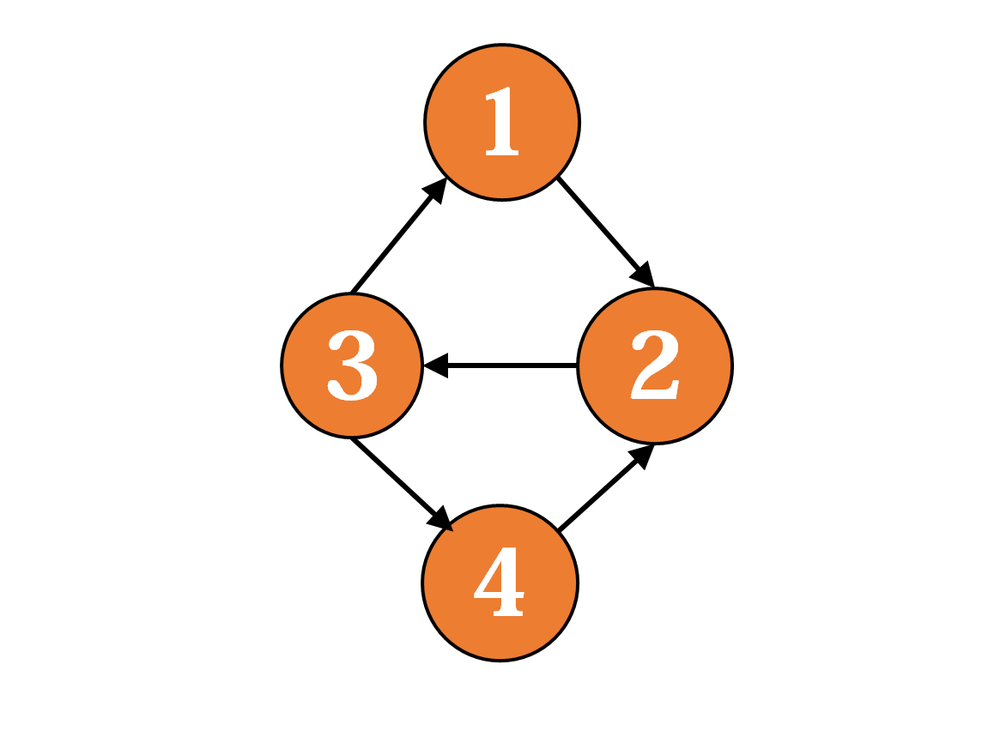
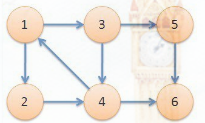
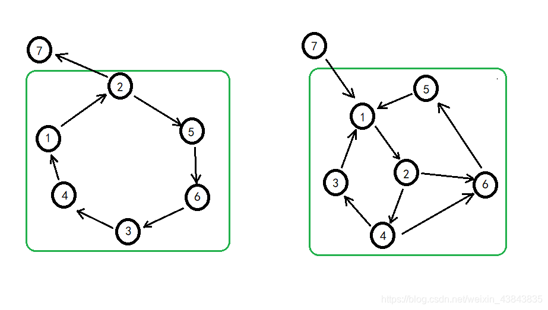
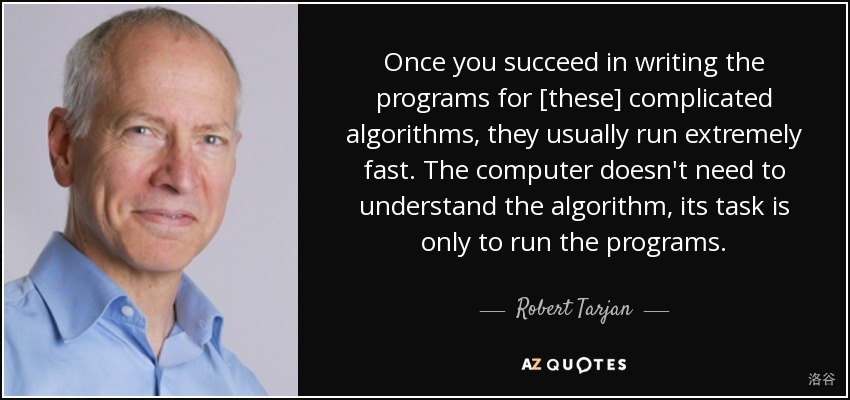
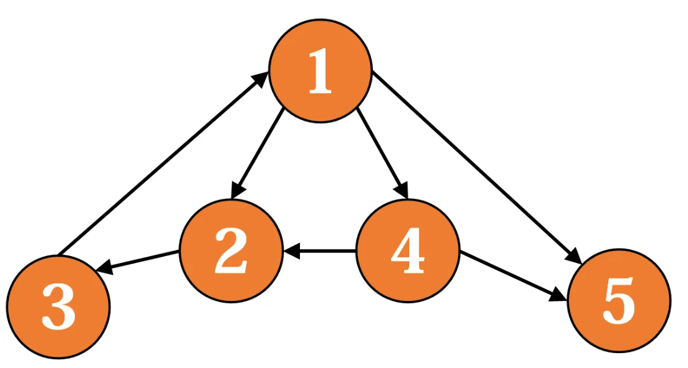
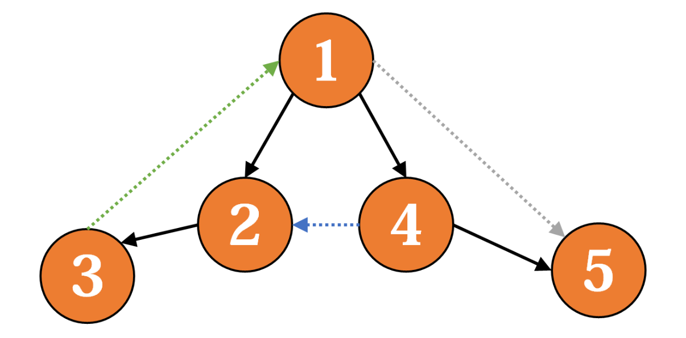
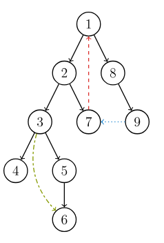
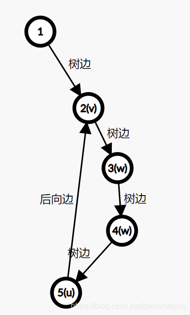
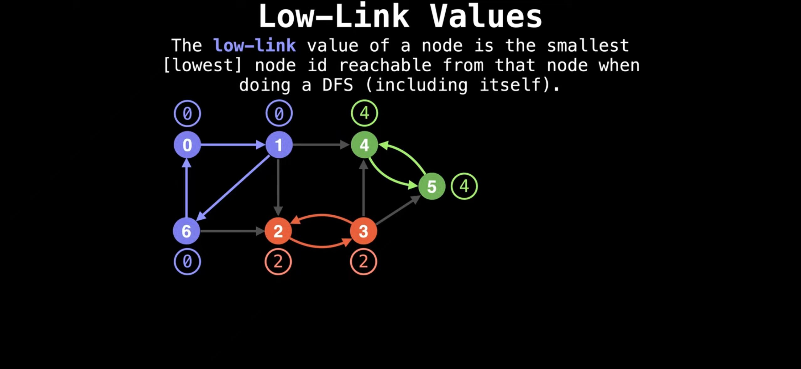

<!-- _class: cover_a 
<!-- _header: "" --> 
<!-- _footer: "" --> 
<!-- _paginate: "" --> 
# SCC和Tarjan算法
###### 基础

starAndHonor
北师大台州附属高级中学
2024.7.17

## 课程内容

<!-- _class: cols2_ol_ci fglass toc_a  -->
<!-- _footer: "" -->
<!-- _header: "CONTENTS" -->
<!-- _paginate: "" -->

- [SCC](#3)
- [Tarjan的铺垫](#8) 
- [Tarjan](#15) 
- [好题选讲](#25)
- [最后一页](#31)

## 什么是SCC

<!-- _class: trans -->
<!-- _footer: "" -->
<!-- _paginate: "" -->

## 强联通分量

**强联通**:任意两个结点连通

**强连通分量**<b>SCC</b>的定义是：极大的强连通子图。

## 来看图
<!-- _class: cols-2 -->

<div class=ldiv>



</div>

<div class=rimg>

点1,2,3强联通
点2,3,4强联通
{1,2,3,4}是**强连通分量**
<br>
PS:**极大**保证把图划分为若干个强连通分量后，不存在两个强连通分量相互可达。

</div>

## 再来一个
<!-- _class: cols-2 -->

<div class=ldiv>



</div>

<div class=rimg>

{1,2,3,4},{5},{6}是**强连通分量**

</div>

## 

<!-- _class:  bq-purple -->
>思考
>
>有人认为强联通分量就是环,请思考强连通分量和环的关系:

- 每个强连通分量至少包含一个环。
- 并非所有包含环的子图都是强连通的。


## Tarjan的铺垫
<!-- _class: trans -->
<!-- _footer: "" -->
<!-- _paginate: "" -->

## 

## 如何得到DFS生成树
在dfs时，每当通过某条边e访问到一个新节点v，就加入这个点和这条边，最后得到的便是dfs生成树。



## DFS 生成树

<!-- _class: cols-2 -->

<div class=limg>



</div>

<div class=rdiv>

我们将一个有向图的 DFS 生成树分成 4 种边
1. **树边**：示意图中以黑色边表示，每次搜索找到一个还没有访问过的结点的时候就形成了一条树边。
2. **反祖边**（back edge）：示意图中以红色边表示（即 $7 \rightarrow 1$），也被叫做回边，即指向祖先结点的边。
3. **横叉边**（cross edge）：示意图中以蓝色边表示（即 $9 \rightarrow 7$），它主要是在搜索的时候遇到了一个已经访问过的结点，但是这个结点**并不是**当前结点的祖先。
4. **前向边**（forward edge）：示意图中以绿色边表示（即$3 \rightarrow 6$），它是在搜索的时候遇到子树中的结点的时候形成的。
</div>

## 分析边的性质
1. **前向边**:没啥用,删除后不改变连通性
2. **反向边**:成环的关键,如果删去所有反向边，那么原图会成为有向无环图。
3. **横叉边**:这种边本身不产生环，但是它可能把两个强连通子图“连接”起来，形成一个更大的强连通子图。


## dfn序

```cpp
int dfn[MAXN],cnt = 0,vis[MAXN];
void dfs(int u){
  dfn[u] = ++cnt;
  vis[u] = true;
  for(auto v:gr[u]){
    if(!vis[v])dfs(v);
  }
}
```
dfn序表征的是dfs过程中访问节点的顺序。
早访问的节点dfn序小
## dfn表征的几种边的性质
对有向边(u,v)
前向边 dfn[u] < dfn[v]
**反向边** dfn[u] > dfn[v]
**横向边** dfn[u] > dfn[v]

## Tarjan
<!-- _class: trans -->
<!-- _footer: "" -->
<!-- _paginate: "" -->

## 返祖边

返祖边(u,v)的特征:dfn[v] < dfn[u]
但是这横叉边也有，那么如何区分呢？
<br>

考虑维护一个栈：栈中的元素是当前搜索树上的点。显然，如果一条边u→v是返祖边，那么当我们在**访问u时会发现v已经在栈中**(v是祖先)。然后，如果**dfn[v] < dfn[u]**，则u→v是返祖边。如果是横向边v已经出栈。
<br>
如何判断一个数是否在栈中？
我们定义**instack[]数组**，节点u入栈时instack[u]=true，出栈时instack[u]=false，查询v是否在栈中用if(instack[v])。

## 追溯值
我们希望用一种方法标明，栈中的元素，从v到u，都属于同一个SCC。
<br>
我们引入low[]数组，low[u]代表包含u的SCC中第一个被搜索到的节点(**根**)的dfn值，也可以理解为从u出发能回溯到的dfn最小的节点的dfn值。

## 同一个强连通分量low都为dfn[v]
<!-- _class: cols-2 -->

<div class=limg>

显然，若u→v是一个返祖边，那么v是u的祖先，v是v、u所在的SCC中最先被访问到的节点，low[u]=dfn[v]。而且，对于v→u路径（都是树边）上的每一个节点w，有low[w]=dfn[v]，因为w和v、u属于同一个SCC。

</div>

<div class=rdiv>



</div>

## 如何求low
1. u未访问过，(u,v)是树边,low[u] = min(low[u],low[v])，
2. u访问过且在栈里,(u,v)是返祖边，low[u] = min(low[u],dfn[v])

##  


## 横叉边
我们并不会在函数返回时直接把结点弹出栈，而是在**整个强连通分量搜索完之后再弹出**，这样由横叉边引入的结点也可以加入强连通分量了。

性质:**一个SCC中的点都在以SCC的根为根的子树中**

## 同一个SCC
当回溯到**low[u] == dfn[u]** 时就访问到了 **根**

给每个节点**染色**，在同一个SCC中的节点拥有相同的颜色。
访问到根时就弹栈直到u出栈,并染上同一种颜色

## code
```cpp
int dfn[MAXN], low[MAXN], cnt, stk[MAXN], top, scnt, nw[MAXN], w[MAXN],
    bel[MAXN];  bool instk[MAXN];
inline void tarjan(int u) {
  dfn[u] = low[u] = ++cnt;
  stk[++top] = u, instk[u] = true;
  for (auto v : gr[u])
    if (!dfn[v]) {
      tarjan(v);  low[u] = min(low[u], low[v]);
    } else if (instk[v])  low[u] = min(low[u], dfn[v]);
  if (low[u] == dfn[u]) {
    scnt++;int now;
    do {
      now = stk[top--]; bel[now] = scnt;  instk[now] = false; nw[scnt] += w[now];
    } while (now != u);
  }
}
```
## 不连通图
```cpp
  for (int i = 1; i <= n; i++)
    if (!dfn[i])
      tarjan(i);
```

## 好题选讲
<!-- _class: trans -->
<!-- _footer: "" -->
<!-- _paginate: "" -->

## 【模板】缩点[P3387](https://www.luogu.com.cn/problem/P3387) 
给定一个 $n$ 个点 $m$ 条边有向图，每个点有一个权值，求一条路径，使路径经过的点权值之和最大。你只需要求出这个权值和。

允许多次经过一条边或者一个点，但是，重复经过的点，权值只计算一次。

## 解:

缩点后拓扑
注意缩点后点权的处理

## [USACO03FALL / HAOI2006] 受欢迎的牛 G[P2341](https://www.luogu.com.cn/problem/P2341)
每头奶牛都梦想成为牛棚里的明星。被所有奶牛喜欢的奶牛就是一头明星奶牛。所有奶牛都是自恋狂，每头奶牛总是喜欢自己的。奶牛之间的“喜欢”是可以传递的——如果 $A$ 喜欢 $B$，$B$ 喜欢 $C$，那么 $A$ 也喜欢 $C$。牛栏里共有 $N$ 头奶牛，给定一些奶牛之间的爱慕关系，请你算出有多少头奶牛可以当明星。


## 解
缩点后只有一个出度为0的SCC，答案为size(SCC)

## Tarjan处理问题一般流程
有向有环图---(Tarjan缩点)--->有向无环图---(DAG上算法)--->结果


## 欢迎交流~~~ 

<!-- _class: trans -->
<!-- _footer: "" -->
<!-- _paginate: "" -->
<div>

</div>
