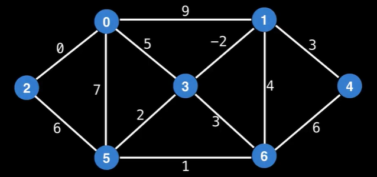
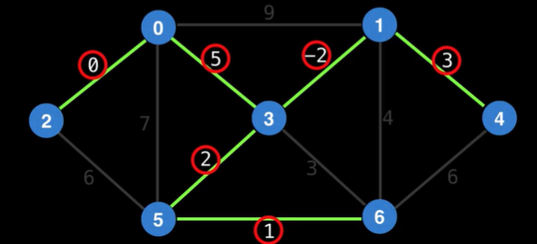
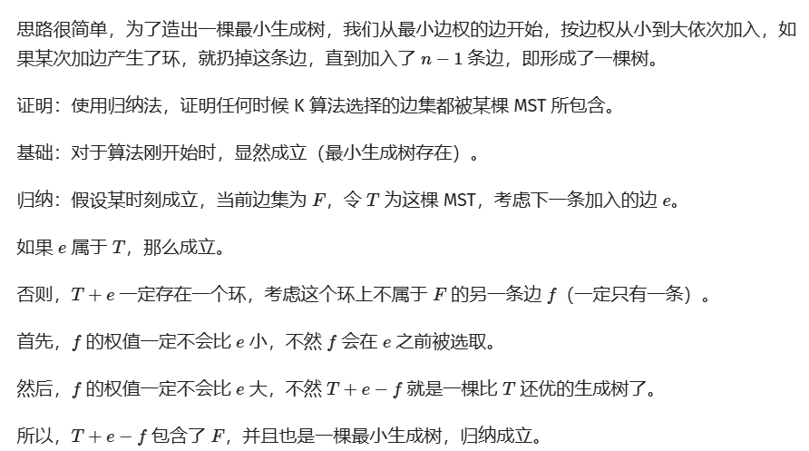
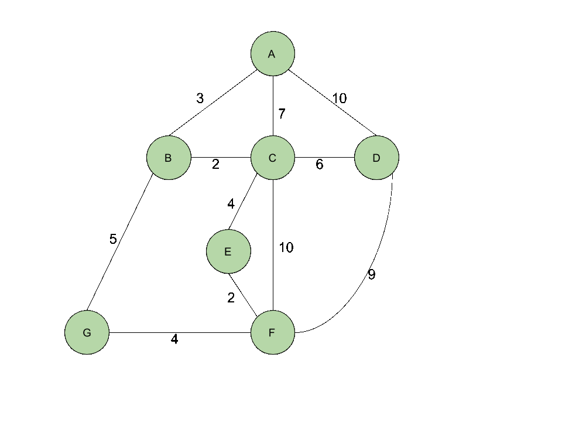

<!-- _class: cover_a 
<!-- _header: "" --> 
<!-- _footer: "" --> 
<!-- _paginate: "" --> 
# 最小生成树（MST）
###### 进阶

starAndHonor
北师大台州附属高级中学
2024.7.15


## 课程内容

<!-- _class: cols2_ol_ci fglass toc_a  -->
<!-- _footer: "" -->
<!-- _header: "CONTENTS" -->
<!-- _paginate: "" -->

- [基础回顾](#3)
- [Kruskal算法](#7) 
- [Prim算法](#14)
- [两种算法比较](#19)
- [MST好题选讲](#21)
- [瓶颈生成树和最小瓶颈路](#34)
- [Kruskal 重构树](#36)
- [最后一页](#38)

## 1. 什么是最小生成树

<!-- _class: trans -->
<!-- _footer: "" -->
<!-- _paginate: "" -->

## 最小生成树（MST）

<!-- _class: pin-3 -->

<div class="tdiv">

> 生成树（spanning tree）:一个连通无向图的生成子图，同时要求是树。也即在图的边集中选择 <b>n - 1</b> 条，将所有顶点连通。

> 无向连通图的最小生成树（Minimum Spanning Tree，MST）:边权和最小的生成树。

下例左图中,有不止一种MST(找一找)，其中一种如右图，最小边权和为
$$
    0 + 5 + -2 + 3 + 2 + 1 = 9
$$
</div>

<div class="limg">


</div>

<div class="rimg">


</div>

## 生成树的性质

<!-- _class: col1_ol_sq fglass -->

- 在不连通图中不存在生成树，可以存在生成森林
- 树的性质:N个顶点的连通图中有N-1条边。生成树内无环。
- 一个具有n个顶点,e条边的简单无向图, 构造生成树需要删除E-N+1条边
- 凯莱公式(Cayley’s Formula):具有 n 个顶点的简单无向图（即没有自环和重边的图）的生成树（spanning tree）的数量w为$n^{n-2}$ ([利用Prüfer序列证明](https://oi-wiki.org/graph/prufer))

## 最小生成树的性质
证明链接:https://www.cnblogs.com/cbdsopa/p/16035326.html
<!-- _class: col1_ol_sq fglass -->

- 对于一张边权互不相同的无向图，其存在唯一的最小生成树。
- 对于一个无向图，其每种最小生成树的每种边权的数量是一定的。
- 对于一个无向图，其最小生成树上的简单路径都为最小瓶颈路。（但是最小瓶颈路不一定都在最小生成树上）

## Kruskal算法
<!-- _class: trans -->
<!-- _footer: "" -->
<!-- _paginate: "" -->

## 想一想
- 我们的**目标**是什么？
从一个n个节点的无向连通图中寻找到一棵**树**,使得**边权和最小**
- 如何找一棵**树**？
找n-1条**边**连接n个顶点,可为树
- 如何保证n-1条边不会形成环?
使用**并查集**先判环再加边,若成环则跳过这条边
- 如何得到**最小边权和**?
想法一:贪心,每次选择边权最小的边,这个贪心正确吗？
想法二:可以选择DP吗?你能够找到最优子结构吗？你能保证无后性吗？
## Kruskal算法
该算法由 Joseph Bernard Kruskal， Jr. 于 1956 年描述。
一言以蔽之:
Kruskal算法是一种贪心算法，通过按权重排序边并逐步构建不相交的最小生成树，直到包含图中所有顶点为止。
## 算法流程
1. 排序：将图中的所有边按照权重从小到大排序。
2. 初始化：创建一个空的森林，每个顶点都是一个单独的树。
3. 选择边：按排序顺序考虑每条边，如果这条边连接的两个顶点不在同一个树中，则将这条边添加到MST中，并将两个顶点所在的树合并。
4. 重复：重复步骤3，直到森林中只剩下一棵树，或者所有边都被考虑过。
## 代码(朴素实现)
```cpp
vector<int> tree_id(n);//染色,限制了算法时间复杂度
vector<Edge> result;//Edge : u,v,weight
for (int i = 0; i < n; i++)tree_id[i] = i;
sort(edges.begin(), edges.end());
for (Edge e : edges) {
    if (tree_id[e.u] != tree_id[e.v]) {//不成环
        result.push_back(e);
        int old_id = tree_id[e.u], new_id = tree_id[e.v];
        for (int i = 0; i < n; i++)
            if (tree_id[i] == old_id)
                tree_id[i] = new_id;
    }
}
```
## 优化(并查集优化)
```cpp
  //默认大家会并查集
  //算法复杂度为O(mlogm),m为边数
  sort(e + 1, e + 1 + m);
  build(n);//初始化并查集
  for (int i = 1; i <= m; i++) {
    if (find(e[i].u) == find(e[i].v))
      continue;
    else
      merge(e[i].u, e[i].v), chosen[i] = true, cnt++;
    if (cnt == n - 1)
      break;
  }
```


## 正确性证明(来自OIwiki)
<div>



</div>

## Prim算法
<!-- _class: trans -->
<!-- _footer: "" -->
<!-- _paginate: "" -->

## 想一想
- 如何找一棵**树**？
找n-1条边连接n个**顶点**,可为树
- 如何得到**最小边权和**?
从任意一个顶点开始，每次选择一个与当前**顶点集**最近的一个顶点，并将两顶点之间的边加入到树中(相当抽象)
<div>  



</div>

## 算法流程
1. 初始化：选择一个起始顶点，将其加入到最小生成树（MST）中，并将其距离标记为0。其他所有顶点的距离初始化为无穷大（或一个非常大的数）。

2. 构建MST：重复以下步骤，直到所有顶点都被包含在MST中：
- 从所有未被包含在MST中的顶点中，找到距离MST最近的顶点，这个顶点通过一条边连接到MST上，并且这条边的权重是最小的。
- 将这个顶点和连接它的边加入到MST中。
- 更新新加入MST的顶点的所有邻接顶点的距离：如果通过新加入的边可以找到更短的路径到达这些邻接顶点，则更新它们到MST的距离。

## 代码($O(n^2)$)
```cpp
int prim() {//我们将点分为已选点集A和未选点集B,记MST的边的集合为T
	int ans = 0;
	int cnt = 1;
	for(int i = 1; i<=n; i++)mst[i] =0, p[i] =1;
	for(int i = 1; i<=n; i++)lowcost[i] = gr[1][i];
	mst[1] =1, lowcost[1] = 0,p[1]=0;
	for(int i = 2; i<=n; i++) {
		int k,minn = inf;
		for(int j = 1; j<=n; j++)if(!mst[j]&&lowcost[j]<minn)k = j,minn = lowcost[j];//找距离A最近点
		ans+=lowcost[k];
		lowcost[k] = 0,mst[k] = 1;//加入B
		cnt++;
		for(int j = 1; j<=n; j++)
                    if(lowcost[j]&&!mst[j]&&lowcost[j]>=gr[k][j])
                        lowcost[j] = gr[k][j],p[j] = k;//更新p[]
	} 
    for(int i = 1;i<=n;i++)//如果存在lowcost[i]==inf,说明不联通
        if(lowcost[i]==inf)return -1;
	return ans;
}
```
## 优化
我们考虑这个问题复杂度的瓶颈在哪?**寻找最近顶点**
可以采取类似Dijkstra算法用最小堆来优化
代码和原理[OIwiki](https://oi-wiki.org/graph/mst/#prim-%E7%AE%97%E6%B3%95)上有,自学吧！
## 两种算法比较
<!-- _class: trans -->
<!-- _footer: "" -->
<!-- _paginate: "" -->

## 两种算法比较
<!-- _class: pin-3 -->
<div class="tdiv">

<!-- _class:  bq-purple -->

> 图论基本视角:
> 
> Kruskal 和 Prim 分别从图的两个基本元素边和点进行思考,边和点是图论的两个视角。
</div>
<div class="limg">
Kruskal

- 基于边的算法,基本思想是从小到大加入边
- 复杂度$O(mlogm)$
- 在大部分情况下都不错,**一般用Kruskal**
</div>

<div class="rimg">
Prim

- 基于点的算法,基本思想是从一个结点开始，不断加点
- 复杂度(二叉堆实现)：$O((n+m) log n)$
- 在稠密图尤其是完全图上有优势
</div>

## MST好题选讲
<!-- _class: trans -->
<!-- _footer: "" -->
<!-- _paginate: "" -->

## 板题[LuoguP3366](https://www.luogu.com.cn/problem/P3366)
如题，给出一个无向图，求出最小生成树，如果该图不连通，则输出 orz。

## The Unique MST[POJ679](https://vjudge.net/problem/POJ-1679#author=swust5120177231)
“来吧，让我们开始游戏吧！”
空和妹妹白这一天又很无聊，他们决定进行一场较量！
于是他们开始玩一个游戏：妹妹白先从N个点的图中选出N-1条边，使得N个点连通，并且所选的边的权值之和最小。哥哥空再来一次同样的操作，但是他不能跟妹妹选择的边完全一样，他需要找到另外一种方案，使得他找到的N-1条边的权值之和和妹妹相同，如果找不到他就输了。

## 解:
**简明题意**:给定一个连通的无向图，判断其最小生成树是否**唯一**。
如果存在两颗最小生成树的话,必定至少存在一条不同的边e。
那么如果说我们删除e,那么其中一颗含有e的生成树T就没了,
再做Kruskal,就可以得到其他最小生成树,如果与T权值和相同则不唯一。
当然，我们也要考虑到会不会存在删除一条边使得最小生成树不存在(图不连通)的情况。

## 部落划分[P4047](https://www.luogu.com.cn/problem/P4047)

聪聪研究发现，荒岛野人总是过着群居的生活，但是，并不是整个荒岛上的所有野人都属于同一个部落，野人们总是拉帮结派形成属于自己的部落，不同的部落之间则经常发生争斗。只是，这一切都成为谜团了——聪聪根本就不知道部落究竟是如何分布的。不过好消息是，聪聪得到了一份荒岛的地图。地图上标注了 $n$ 个野人居住的地点（可以看作是平面上的坐标）。我们知道，同一个部落的野人总是生活在附近。我们把两个部落的距离，定义为部落中距离最近的那两个居住点的距离。聪聪还获得了一个有意义的信息——这些野人总共被分为了 $k$ 个部落！这真是个好消息。聪聪希望从这些信息里挖掘出所有部落的详细信息。他正在尝试这样一种算法：对于任意一种部落划分的方法，都能够求出两个部落之间的距离，聪聪希望求出一种部落划分的方法，使靠得最近的两个部落尽可能远离。
例如，下面的左图表示了一个好的划分，而右图则不是。请你编程帮助聪聪解决这个难题。


## 解:
题目较长,建模难度较高
**简明题意**:将一群点划分为k个点集,使得点集间距离的最小值尽可能大。
(两个点集间的距离为点集中距离最近的两个点的距离。)
**转化为**将n个点的完全图划分为k个联通块,尽可能将短边放在连通块内部(**贪心**)(类比**Kruskal**)
**方法**建立n个节点完全图,Kruskal算法到剩余k个连通块,
即连接(n-1)-(k-1)=n-k条边,答案为MST的第n-k+1条边

<!-- _class:  bq-purple -->

> Kruskal理解
>
> 每加一条边,连通块就会-1

## 另解:
能否二分？
如何check?

## Railway System[CF1687B](https://www.luogu.com.cn/problem/CF1687B)

**这是一道交互题。**

在八坂神奈子和守矢神社的监督之下，幻想乡内的铁路系统 GSKR 取得了成功。它包含着 $n$ 个站点和 $m$ 条双向的铁路道路相连，第 $i$ 条道路有一个长度 $l_i(1 \leq l_i \leq 10^6)$。由于预算限制，这个铁路系统可能并不是联通的。两个站点之间也有可能有多条铁路道路直接相连。

一个铁路系统的总价值是它上面所有道路的长度之和，而一个铁路系统的容量的最大（最小）值等同于其最大（最小）权的极大生成森林的总价值。其中，极大生成森林指的是一个连通性与原图相同的生成森林。

现在神奈子有一个模拟装置，它可以产生不超过 $2m$ 次询问，每次询问输入一个长度为 $m$ 的字符串 $s$（仅由 $0$ 或 $1$ 构成），其中当 $s_i=1$ 的时候，这个模拟装置会假定第 $i$ 条铁路道路是可以使用的。这个模拟装置会告诉神奈子这个铁路系统的最大容量。

神奈子希望借助这个模拟装置，知道如果每一条铁路道路都能使用上的话，那么铁路系统的最小容量会是多少。

这个铁路系统的结构是已定的，换而言之，交互库并非自适应。

## 解:
题目有亿点长。
**简明题意**:给定一个n个点m条边的图。你可以询问2m次：选取原图中的某些边之后，在这些边中找到的最大生成森林的边权之和。你需要回答整个图的最小生成森林的边权和。

**解**:每条边的边权可以直接查到。然后考虑Kruskal构造MST过程,发现无法判断加边是否会成环。
如果加入的这条边在最大容量上(加边前后最大容量改变值为边权),那么一定不成环。

<!-- _class:  bq-purple -->
>交互题
>
> 要清缓存 ,C++中输出后使用fflush(stdout) or cout.flush() 

## Road Reform[CF1468J](https://www.luogu.com.cn/problem/CF1468J)
柏兰有n个城市和m条双向道路。第i条道路连接城市$x_i$和$y_i$，限速为$s_i$。道路网络允许每个人从任何一个城市到达另一个城市。

柏兰交通部计划进行道路改革。

首先，维护所有m条道路成本太高，因此将拆除m−(n−1)条道路，以使剩下的(n−1)条道路仍然可以实现任何城市到任何其他城市的到达。具体而言，剩下的道路应该构成一棵无向树。

其次，剩下的道路上的限速可能会发生变化。变化将逐个进行，每次变化要么增加某条道路的限速1，要么减少1。由于改变限速需要大量工作，交通部希望最小化改变次数。

交通部的目标是拥有(n−1)条道路的道路网络，所有道路的最大限速恰好等于k。他们委托你计算最小的限速变化次数，以满足道路网络的要求。

## 解:
**简明题意**对于一个 n 点 m 边的无向图，保留 n−1 条边使其变成树。每次操作可以对一条边权修改 1，使得边权中最大值为 k，求操作次数。
**解**：对于大于k的边，要么删了，要么放到树里调整。最小生成树,小于等于k的边不变,大于k的边修改为k，最优。如果所有边都比k小,把最接近k的调整为k,再进行操作
**官方题解**https://codeforces.com/blog/entry/85951

PS：多测不清,

## Make It Connected[CF1095F](https://www.luogu.com.cn/problem/CF1095F)
给你n个点,每个点有一个权值$a_i$,已知连接两点的代价为$a_i+a_j$,现在还有其他的m种连接方法,连接$u,v$的费用为$w$.
求出让这个图连通的最小代价.

## 解:
有人说是板？
n较小时确实。题目中范围$n \ge 2e5$,$m \ge 2e5$
难点在会TLE
**如何建图?**
MST中只会取n-1条边
最小的n-1条就是最小权值的点与其他点相连形成的
在加上m条特殊边
跑Kruskal即可

## [COCI2009-2010#7] SVEMIR[P8074](https://www.luogu.com.cn/problem/P8074)

太空帝国要通过建造隧道来联通它的 $N$ 个星球。

每个星球用三维坐标 $(x_i,y_i,z_i)$ 来表示，而在两个星球 $A,B$ 之间建造隧道的价格为 $\min\{|x_A-x_B|,|y_A-y_B|,|z_A-z_B|\}$。

现要建造 $N-1$ 条隧道使得所有的星球都能直接或间接相连。求完成该任务所需的最小总价。

## 解:

三维问题降为一维——分开考虑$x,y,z$
边数多建图会MLE——选出有效边建图(相邻有效,共3*(n-1)条边)
跑Kruskal即可

<!-- _class:  bq-purple -->
>图论一大难点——建图
>
> 如何在朴素建图上优化?

## 更多练习
[算法进阶指南0x60](https://www.acwing.com/activity/content/introduction/6/)

## 瓶颈生成树和最小瓶颈路
<!-- _class: trans -->
<!-- _footer: "" -->
<!-- _paginate: "" -->

## 自学环节

营救[P1396](https://www.luogu.com.cn/problem/P1396)
【模板】最小瓶颈生成树（数据加强版）[daimayuan#805](http://oj.daimayuan.top/problem/805)

## Kruskal 重构树

<!-- _class: trans -->
<!-- _footer: "" -->
<!-- _paginate: "" -->

## 自学环节
[自学资料](https://blog.csdn.net/C20190102/article/details/102868292)
**一定要写**[[NOIP2013 提高组] 货车运输](https://www.luogu.com.cn/problem/P1967)
[BZOJ Network](https://hydro.ac/d/bzoj/p/3732)


## 欢迎交流~~~ 

<!-- _class: trans -->
<!-- _footer: "" -->
<!-- _paginate: "" -->
<div>

</div>