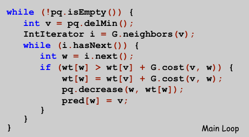
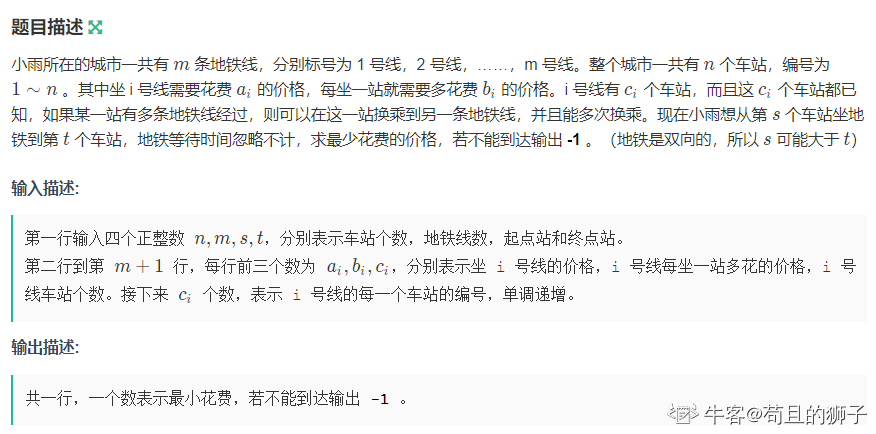
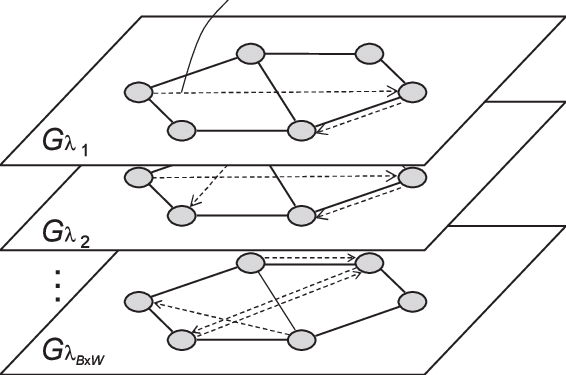

<!-- _class: cover_a 
<!-- _header: "" --> 
<!-- _footer: "" --> 
<!-- _paginate: "" --> 
# 最短路算法及其应用
###### 进阶

郑辰阳
北师大台州附属高级中学
2024.7.16

## 课程内容

<!-- _class: cols2_ol_ci fglass toc_a  -->
<!-- _footer: "" -->
<!-- _header: "CONTENTS" -->
<!-- _paginate: "" -->

- [经典最短路算法](#3)
- [好题选讲](#21)
- [柳暗花明](#39) 
- [最后一页](#46)

## 最短路

<!-- _class: trans -->
<!-- _footer: "" -->
<!-- _paginate: "" -->

## 最短路

> 回字有四样写法，你知道么?


## 如何求最短路(常见)

<!-- _class: col1_ol_sq fglass -->
学过OI，……我便考你一考。一张图的最短路，怎样求的？——赛博乙己
- Floyed算法
- **Dijkstra算法**
- Bellman–Ford 算法和SPFA

##


## DFS
```cpp
//虽然代码很好写，但是极容易超时，请谨慎食用此算法
void dfs(int x,int step)
{
	dis[x]=step;//更新数据
	for(int i=1;i<=n;i++)
    	if(g[x][i])
        {
        	g[x][i]=0;
           	dfs(i,step+1);
            g[x][i]=1;
         }
}
```
## BFS
```cpp
const int dx[]={-1,1,0,0},dy[]={0,0,-1,1};//位移数组
while(!q.empty())//如果队列不空就说明还有点没有搜到，就继续搜
{
	.......
	for(int i=0;i<4;++i)
	{
		int xx=x+dx[i],yy=y+dy[i];//找到新的点的坐标
		if(xx<=0||xx>n||yy<=0||yy>n||vis[xx][yy])//二维矩阵要特判是否越界
			continue;
		q.push(xx);
		q.push(yy);
	}
}
```
## Dijkstra算法

<!-- _class: trans -->
<!-- _footer: "" -->
<!-- _paginate: "" -->
##


## Edge Relaxation
定义:对于所有节点$u$,$dis[u]$为从原点$s$到$u$的一些路径的长度
Edge Relaxation:
- 考虑边(u,v),边权为w
- 如果从s到u加上(u,v)比当前路径到v更好,那么更新
```cpp
if(dis[v]>dis[u]+w){
    dis[v] = dis[u]+w;
    pre[v] = u;
}// edge relaxation
```
## Dijkstra算法
- 初始化dis[除了s以外]=$\infty$,$dis[s] = 0$
- 插入所有点$v$到一个以$dis[v]$表示优先级的优先队列
- 重复在优先队列中删除有最小$dis[v]$的$v$
  - 加入$v$到$S$
  - 对于$(v,w)$,松弛$(v,w)$


## SPFA
<!-- _class: trans -->
<!-- _footer: "" -->
<!-- _paginate: "" -->

## 那个传说中已死的算法

- 关于SPFA,他已经死了……
- 这个算法其实国外很早就有了，叫 Bellman-Ford-Moore Algorithm
- 国内那篇段姓学者的论文中的复杂度证明是随机情况下，但不是最坏，而且论文中有一些错误
- 在竞赛中使用出题人有+10086方法卡你
- 啥？你会别的优化，不好意思都能卡
[如何看待 SPFA 算法已死这种说法？ - fstqwq的回答 - 知乎](
https://www.zhihu.com/question/292283275/answer/484871888)
<br>
**一般别用**，写Dijkstra算法不香吗
但是，其实吧，这玩意在一些时候还是可以**惊坐起**的。

## Bellman-Ford Algorithm
把所有边松弛$n-1$遍
```cpp
void Bellman_Ford(int n, int m){
    for (int j = 0; j < n - 1; ++j)
        for (int i = 1; i <= m; ++i)
            dist[edges[i].to] = min(dist[edges[i].to], dist[edges[i].from] + edges[i].w);
}
```
证明不重要
## Bellman-Ford-Moore Algorithm
#### 只更新可能更新的点
- 只让当前点能到达的点入队
- 如果一个点已经在队列里，便不重复入队
- 如果一条边未被更新，那么它的终点不入队

证明不重要
## code
```cpp
//一个点入队超过n-1次则有负环
queue<int> Q;Q.push(s);
while (!Q.empty()){
    int p = Q.front();Q.pop();
    inqueue[p] = 0;
    for (int e = head[p]; e != 0; e = edges[e].next){
        int to = edges[e].to;
        if (dist[to] > dist[p] + edges[e].w){
            dist[to] = dist[p] + edges[e].w;
            if (!inqueue[to]){
                inqueue[to] = 1;Q.push(to);
            }
        }
    }
}
```
##

## Floyed 
<!-- _class: trans -->
<!-- _footer: "" -->
<!-- _paginate: "" -->

## 短小的算法往往会有出其不意的效果
```cpp
int dist[400][400];//要初始化为正无穷
void Floyd(int n)
{
    for (int k = 1; k <= n; ++k)
        for (int i = 1; i <= n; ++i)
            for (int j = 1; j <= n; ++j)
                dist[i][j] = min(dist[i][j], dist[i][k] + dist[k][j]);
}
```

## 好题选讲
<!-- _class: trans -->
<!-- _footer: "" -->
<!-- _paginate: "" -->

## 灾后重建[P1119](https://www.luogu.com.cn/problem/P1119)

给出 B 地区的村庄数 $N$，村庄编号从 $0$ 到 $N-1$，和所有 $M$ 条公路的长度，公路是双向的。并给出第 $i$ 个村庄重建完成的时间 $t_i$，你可以认为是同时开始重建并在第 $t_i$ 天重建完成，并且在当天即可通车。若 $t_i$ 为 $0$ 则说明地震未对此地区造成损坏，一开始就可以通车。之后有 $Q$ 个询问 $(x,y,t)$，对于每个询问你要回答在第 $t$ 天，从村庄 $x$ 到村庄 $y$ 的最短路径长度为多少。如果无法找到从 $x$ 村庄到 $y$ 村庄的路径，经过若干个已重建完成的村庄，或者村庄 $x$ 或村庄 $y$ 在第 $t$ 天仍未重建完成，则需要输出 $-1$。
## 解:

两个操作:加点,询问最短路
数据范围小，可否使用Floyed算法?
但是你真的懂得这个算法吗？
你能说出这个算法是什么想法吗？

## Floyed再谈

这玩意是个DP
每一次循环更新**经过前$k$个节点，$i$到$j$的最短路径**。
k本来是dist[][][]中的第一个维度,但是可以优化掉
最短路上的子路也是最短路,加入点k后只需用i到k和k到j的最短路更新即可
所以
$$dist_{i,j} = min(dist_{i,j}, dist_{i,k} + dist_{k,j})$$

## 回到这题

加点不就和Floyed DP的逻辑类似吗？
而且查询是$O(1)$的(Q的次数很多)
修改$O(n^2)$
```cpp
//设加入的点为k
for (int i = 1; i <= n; ++i)
    for (int j = 1; j <= n; ++j)
        dist[i][j] = min(dist[i][j], dist[i][k] + dist[k][j]);
```
## 最优贸易[P1073](https://www.luogu.com.cn/problem/P1073)

too long 自己去看


## 解

**50pts**:
拓扑+dp。设A[u]为1到u点权最小值,B[u]为u到n点权最大值
在正图上dp可得A,在反图上dp可得B,答案max{A[u]-B[u]}
**100pts**
法一:SPFA+dp dp一样,然后外面用SPFA
法二:Tarjan后转换为DAG

## Elaxia的路线 [P2149](https://www.luogu.com.cn/problem/P2149)

最近，Elaxia 和 w** 的关系特别好，他们很想整天在一起，但是大学的学习太紧张了，他们必须合理地安排两个人在一起的时间。

Elaxia 和 w** 每天都要奔波于宿舍和实验室之间，他们 希望在节约时间的前提下，一起走的时间尽可能的长。

现在已知的是 Elaxia 和 w** 所在的宿舍和实验室的编号以及学校的地图：  
地图上有 $n$ 个路口，$m$ 条路，经过每条路都需要一定的时间。 具体地说，就是要求无向图中，两对点间最短路的最长公共路径。

## 解
最短路不止一条，两点间所有最短路形成一个DAG，成为最短路图
四次Dijkstra算法,求出正图上s出发最短路A[]，和返图上t出发最短路B[]
然后判断一条边是否在最短路图上,A[u]+B[v]+w = A[t]
因为最短路的子路也是最短路
然后得到将两个最短路图的公共边形成DAG后拓扑+DP即可
正反向建图都拓扑一次求出顺着和反着走的最长路，取大即可

##  [Code+#4] 最短路[P4366](https://www.luogu.com.cn/problem/P4366 )

企鹅国中有 $N$ 座城市，编号从 $1$ 到 $N$ 。

对于任意的两座城市 $i$ 和 $j$ ，企鹅们可以花费 $(i~\mathrm{xor}~j) \times C$ 的时间从城市 $i$ 走到城市 $j$ ，这里 $C$ 为一个给定的常数。

当然除此之外还有 $M$ 条单向的快捷通道，第 $i$ 条快捷通道从第 $F_i$​​ 个城市通向第 $T_i$​​ 个城市，走这条通道需要消耗 $V_i$​​ 的时间。

现在来自 **P**enguin **K**ingdom **U**niversity 的企鹅豆豆正在考虑从城市 $A$ 前往城市 $B$ 最少需要多少时间？

## 解
瞎搞:直接建图跑Dijkstra,吸口氧过了qwq
正解:$O(n^2)$的边，思考是否有边无用
发现:每一个点和 $2^k$异或，就能从当前点走到任何一个点，且代价不变(二进制下)
只需建立$i$到$i\ xor\ 2^k$的w为$(i\ xor\ 2^k)*C$的边即可


##  [JLOI2011] 飞行路线 [P4568](https://www.luogu.com.cn/problem/P4568)

Alice 和 Bob 现在要乘飞机旅行，他们选择了一家相对便宜的航空公司。该航空公司一共在 $n$ 个城市设有业务，设这些城市分别标记为 $0$ 到 $n-1$，一共有 $m$ 种航线，每种航线连接两个城市，并且航线有一定的价格。

Alice 和 Bob 现在要从一个城市沿着航线到达另一个城市，途中可以进行转机。航空公司对他们这次旅行也推出优惠，他们可以免费在最多 $k$ 种航线上搭乘飞机。那么 Alice 和 Bob 这次出行最少花费多少？

## 解
拆点建一个分层图
各层内部正常连边，各层之间从上到下连权值为0的边。每向下跑一层，就相当于免费搭一次飞机。跑一遍从s到t+n∗k的最短路即可。


## 小雨坐地铁[nc26257](https://ac.nowcoder.com/acm/problem/26257)



## 解
k层每层一条铁路路线
建立k+1层将铁路中转节点连接起来
结果为k+1层起点到终点的最短路

## 分层图


## 建图方式
- 物理建图**直观**
建图时多开一维层，占有空间变大层数倍，可能**MLE**
- 逻辑建图**空间占用小**
借助DP思想，dis和vis数组多开一维(增加层数状态)

## 为啥要分层
考虑DP过程，选取一些有限条数的特殊边会造成后效性。
而解决这种后效的方法就是多加一个状态
放在图上就是分层
需要认识到DP过程在空间上样子

## 柳暗花明
<!-- _class: trans -->
<!-- _footer: "" -->
<!-- _paginate: "" -->

## 小明的游戏[P4554](https://www.luogu.com.cn/problem/P4554)
小明最近喜欢玩一个游戏。给定一个$n \times m$的棋盘，上面有两种格子`#`和`@`。游戏的规则很简单：给定一个起始位置和一个目标位置，小明每一步能向上，下，左，右四个方向移动一格。如果移动到同一类型的格子，则费用是$0$，否则费用是$1$。请编程计算从起始位置移动到目标位置的最小花费。

## 解
本题自然可以用Dijkstra,
但是有没有更加优秀的方法?
**思路打开**
注意到只有两种权值不妨使用01BFS
BFS时边权为0到达的点放队首,为1到达的点放队尾,就实现了双端队列(贪心)

##  [CSP-J2019] 加工零件 [P5663](https://www.luogu.com.cn/problem/P5663)

凯凯的工厂正在有条不紊地生产一种神奇的零件，神奇的零件的生产过程自然也很神奇。工厂里有 $n$ 位工人，工人们从 $1 \sim n$ 编号。某些工人之间存在双向的零件传送带。保证每两名工人之间最多只存在一条传送带。

如果 $x$ 号工人想生产一个被加工到第 $L\,(L \gt 1)$ 阶段的零件，则**所有**与 $x$ 号工人有传送带**直接**相连的工人，都需要生产一个被加工到第 $L - 1$ 阶段的零件（但 $x$ 号工人自己**无需**生产第 $L - 1$ 阶段的零件）。

如果 $x$ 号工人想生产一个被加工到第 $1$ 阶段的零件，则**所有**与 $x$ 号工人有传送带**直接**相连的工人，都需要为 $x$ 号工人提供一个原材料。

轩轩是 $1$ 号工人。现在给出 $q$ 张工单，第 $i$ 张工单表示编号为 $a_i$ 的工人想生产一个第 $L_i$ 阶段的零件。轩轩想知道对于每张工单，他是否需要给别人提供原材料。他知道聪明的你一定可以帮他计算出来！


## 解
分奇偶讨
如果u要做L阶段的零件，就是问1到u的最短路径是否与L奇偶性相同且小于等于L
因为双向传送带，如果奇偶性相同，就可以在两个点之间横跳补足最短路比L小的部分
转化为求1到u的最短奇数路径和最短偶数路径
不妨使用BFS维护最短路径DP一下

##  [TJOI2007] 线段(https://www.luogu.com.cn/problem/P3842)
在一个 $n \times n$ 的平面上，在每一行中有一条线段，第 $i$ 行的线段的左端点是$(i, L_{i})$，右端点是$(i, R_{i})$。

你从 $(1,1)$ 点出发，要求沿途走过所有的线段，最终到达 $(n,n)$ 点，且所走的路程长度要尽量短。

更具体一些说，你在任何时候只能选择向下走一步（行数增加 $1$）、向左走一步（列数减少 $1$）或是向右走一步（列数增加 $1$）。当然，由于你不能向上行走，因此在从任何一行向下走到另一行的时候，你必须保证已经走完本行的那条线段。
## 解:
这题是为了告诉童鞋们最短路不一定仅限于上面说的几个算法
**思路打开**，使用DP
dp[i][0]表示走完第i行且停在第i行的左端点最少用的步数
dp[i][1]表示走完第i行且停在第i行右端点最少用的步数
转移：上一行最左/右走到这一行最左/右然后走下去
```cpp  
dp[i][0] =
      min(dp[i - 1][1] + abs(segs[i].r - segs[i - 1].r) + segs[i].len + 1,
          dp[i - 1][0] + abs(segs[i].r - segs[i - 1].l) + segs[i].len + 1);
dp[i][1] =
      min(dp[i - 1][1] + abs(segs[i - 1].r - segs[i].l) + segs[i].len + 1,
          dp[i - 1][0] + abs(segs[i].l - segs[i - 1].l) + segs[i].len + 1);
```

## 欢迎交流~~~ 

<!-- _class: trans -->
<!-- _footer: "" -->
<!-- _paginate: "" -->
<div>

</div>
